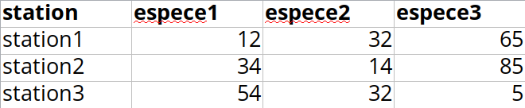
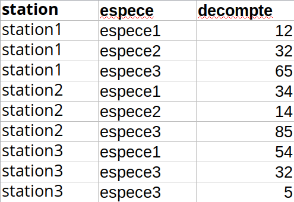



```{r}
#| label: setup
#| echo: false
library(checkdown)
```

## Objectifs de la capsule

À la fin de cette capsule, vous serez en mesure de:

1. Comprendre qu’est-ce qu’un bon jeu de données.
2. Faire la lecture des principaux types de fichiers .dat, .csv, .txt.
3. Comprendre ce qu’est-ce qu'un _data frame_ et connaître les principales fonctions utilisées sur cette classe.
4. Exporter des données dans un fichier depuis R.

## Capsule vidéo



[Télécharger le script R de la vidéo](www/capsule_4.R) (Faire bouton droit -> enregistrer sous...)

## Exercices

::: {.callout-note}
Veuillez noter qu’il est possible d’avoir plus d’une bonne réponse par question. Vous pouvez reprendre chaque exercice grâce aux boutons "Start Over". Le bouton "Indice" est là pour être utilisé!
:::

### Les jeux de données

Le jeux de données suivant (produit par le _Pew Research Center_) explore la relation entre le salaire et la religion aux États-Unis.

```{r quiz1, message=FALSE}
#| echo: false
messy <- read.csv("../data/pew.csv")
knitr::kable(messy[1:6, 1:5])
```

::: {.callout-note appearance="simple" icon=false .question}

```{r}
#| label: question1
#| echo: false
#| results: "asis"
check_question(
  c("Non"),
  options = c("Oui", "Non"),
  type = "radio",
  button_label = "Vérifier",
  right = "✅ Correct !  Les colonnes '<$10k', '$10-20k', '$20-30k', '$30-40k' représentent des valeurs et non des variables. Il serait préférable de créer deux colonnes salaire et dénombrement où salaire contiendrait les valeurs '<$10k'    '$10-20k'  '$20-30k'  '$30-40k' et la colonne dénombrement contiendrait le nombre de répondeurs (27, 34, 60, etc.).",
  wrong = "❌ Incorrect.  Les colonnes '<$10k', '$10-20k', '$20-30k', '$30-40k' représentent des valeurs et non des variables. Il serait préférable de créer deux colonnes salaire et dénombrement où salaire contiendrait les valeurs '<$10k'    '$10-20k'  '$20-30k'  '$30-40k' et la colonne dénombrement contiendrait le nombre de répondeurs (27, 34, 60, etc.).",
  title = "Selon vous, est-ce que ce jeu de données est bien structuré?"
)
```

:::

### Importer des données dans R

En utilisant la fonction `read.table()`, écrivez une ligne de code qui permet de lire correctement le fichier `BIO1006_H2018_Echantillon_espace.dat` dont la structure ressemble à ceci.

_Ne pas changer le nom du fichier, seulement remplacer `...` avec la bonne réponse._

```{r, eval=TRUE, echo=FALSE, comment=""}
cat(readLines("../data/BIO1006_H2018_Echantillon_espace.dat", n = 10), sep = "\n")
```

```{webr}
#| autorun: false
read.table(file = "https://tinyurl.com/bio1006dat", ...)
```

::: {.callout-tip collapse="true"}

### Indice

Le paramètre `sep` permet de spécifier le caractère utilisé pour séparer les colonnes de variables.
:::

::: {.callout-warning collapse="true"}

### Solution

```{r}
#| echo: True
read.table(file = "https://tinyurl.com/bio1006dat", sep = " ")
```

:::

### Les _data frame_

::: {.callout-note appearance="simple" icon=false .question}

```{r}
#| label: question2
#| echo: false
#| results: "asis"
check_question(
  c("read.table()", "read.csv()", "read.delim()"),
  options = c("read.table()", "read.csv()", "read.file()", "read.delim()"),
  type = "checkbox",
  button_label = "Vérifier",
  right = "✅ Correct !  Toutes ces fonctions peuvent ouvrir un fichier texte de données. Cependant, la fonction R de base à utiliser pour ouvrir ces fichiers est read.table().",
  wrong = "❌ Incorrect. Attention! Plusieurs choix peuvent être possibles.",
  title = "Quelle(s) fonction(s) devriez-vous utiliser pour lire un fichier texte de données?"
)
```

:::

::: {.callout-note appearance="simple" icon=false .question}

```{r}
#| label: question3
#| echo: false
#| results: "asis"
check_question(
  c("skip"),
  options = c("skip", "sep", "header"),
  type = "radio",
  button_label = "Vérifier",
  right = "✅ Correct !  skip permet de spécifier le nombre de lignes à sauter/passer au début d'un fichier avant de commencer à lire les données.",
  wrong = "❌ Incorrect.  sep permet de spécifier le caractère utilisé pour séparer les colonnes de variables. header permet de spécifier si la première ligne du fichier correspond aux noms des variables (colonnes).",
  title = "Quel paramètre permet de contrôler le nombre de lignes à sauter/passer au début d'un fichier avant de commencer à lire les données?"
)
```

:::

Le _data frame_ `sondage_bio1006` qui présente le résultat d'un sondage effectué dans le cours de biostatistiques BIO-1006 du programme de baccalauréat en Biologie de l’Université Laval.

```{r echo=FALSE, eval=TRUE}
sondage_bio1006 <- read.table("../data/BIO1006_H2018_Echantillon.csv", header = TRUE, sep = ",", dec = ".")
```

```{r}
sondage_bio1006
```

Utilisez la fonction `head` pour faire afficher les 4 premières lignes du _data frame_ nommé `sondage_bio1006`.

```{webr}
#| autorun: false
sondage_bio1006 <- read.csv("https://tinyurl.com/bio1006csv")
head()
```

::: {.callout-warning collapse="true"}

### Solution

```{r}
#| echo: True
sondage_bio1006 <- read.csv("https://tinyurl.com/bio1006csv")
head(sondage_bio1006)
```

:::

::: {.callout-note appearance="simple" icon=false .question}

```{r}
#| label: question4
#| echo: false
#| results: "asis"
check_question(
  c("Supprime la première colonne (couleur_yeux) du data frame sondage_bio1006."),
  options = c("Supprime la première ligne du data frame sondage_bio1006.", "Supprime la première colonne (couleur_yeux) du data frame sondage_bio1006."),
  type = "radio",
  button_label = "Vérifier",
  right = "✅ Correct !  L'indexation des data frame fonctionnent de la même manière que pour les matrices numériques: M[ligne][colonne].",
  wrong = "❌ Incorrect. L'indexation des data frame fonctionnent de la même manière que pour les matrices M[ligne][colonne].",
  title = "Que fait la commande suivante? sondage_bio1006[, -1]"
)
```

:::

::: {.callout-warning collapse="true"}

### Solution

```{r}
#| echo: True
sondage_bio1006[, -1]
```

:::

## Matériel accompagnateur

### Qu'est-ce qu'un bon jeu de données?

Avant de voir comment importer des données dans R, il est bon de bien comprendre ce qu’est un bon jeu de données. Avoir un jeu de données bien organisé est nécessaire pour faire des analyses statistiques ou des graphiques. Il y a deux propriétés fondamentales qui caractérisent un bon jeu de données:

1. Chaque _ligne_ représente une _observation_.
2. Chaque _colonne_ représente une _variable_.

Imaginons que vous devez faire le recensement de certaines espèces animales à trois différentes stations (station1, station2 et station3). À chacune d’elles, il y a trois espèces différentes (espece1, espece2 et espece3). Notre réflexe est de créer un tableau de données comme suit, avec une colonne par espèce où chaque chiffre correspond au dénombrement noté. C'est ce qu’on appelle un tableau de données au _format large_ (_wide layout_ en anglais).



Le problème avec cette structure est qu'il y a trois colonnes pour représenter les espèces. Les colonnes espece1, espece2 et espece3 ne sont pas des variables, _mais plutôt des valeurs_ d'une variable/colonne que l'on pourrait nommer tout simplement _espece_. Pour créer un jeu de données bien organisé, il faut retenir que chaque colonne représente une variable. C’est ce qu’on appelle le _format long_ (_long layout_ en anglais).

::: {.callout-tip}
N'oubliez pas qu'il faut éviter d'utiliser des caractères accentués dans les noms de variables. C'est pourquoi on nommera la colonne `espece` et non `espèce`.
:::

La façon appropriée de représenter ces données consiste à créer seulement trois colonnes:

1. Une colonne _station_ contenant le nom de la station. Même si celle-ci existait déjà, remarquez comment les valeurs seront dupliquées autant que nécessaire!
2. Une colonne _espece_ contenant les noms des espèces. Remarquez l’omission volontaire des accents, nous y reviendrons.
3. Une colonne _decompte_ contenant le dénombrement de chacune des espèces à chaque station.



### Importer des données dans R

La plupart du temps, les données que vous aurez à importer dans R seront présentées dans de simples fichiers _texte_. Les extensions de ces fichiers les plus souvent rencontrées sont: `.txt`, `.dat`, `.tab` et `.csv`. (Note: il est plus simple d’entrer les données dans un tabulateur de type “Excel” ou Google sheets et de sauvegarder le fichier dans ces formats). La fonction R de base à utiliser pour ouvrir ces fichiers est `read.table()`. Les principaux paramètres de cette fonction que vous devriez connaîtres par coeur sont (`help(read.table)`):

1. `file`: Chemin d'accès vers le fichier à ouvrir sur votre ordinateur.
2. `skip`: Nombre de lignes à passer/sauter au début de fichier avant de commencer à lire les données. En effet les premières lignes des fichiers de données sont souvent des commentaires sur le contexte, l’échantillonnage, etc. (métadonnées).
3. `header`: Est-ce que la première ligne de données du fichier contient les noms des colonnes? C’est le cas la grande majorité du temps!
4. `dec`: Caractère utilisé pour les valeurs décimales (“.” en Anglais ou “,” en Français).
5. `sep`: Caractère utilisé pour séparer les colonnes de variables.

Note sur les chemins d'accès (`file`): La structure du chemin d'accès à un fichier dépend de votre système d'exploitation. Les deux exemples suivants montrent quels pourraient être les chemins d'accès pour un fichier texte nommé `nom_du_fichier.txt` se situant sur le bureau (Desktop) d'ordinateur Linux/Mac et Windows. Ici, `nom_utilisateur` correspond à **votre nom d'utilisateur sur votre système!** De plus, notez que vous devriez toujours utiliser le signe `/` plutôt que `\` dans un chemin d'accès.

Linux/Mac

```bash
/home/nom_utilisateur/Desktop/nom_du_fichier.txt
```

Microsoft Windows

```bash
c:/Users/nom_utilisateur/Desktop/nom_du_fichier.txt
```

::: {.callout-tip}

La fonction `read.table()` est une fonction générique qui peut lire la majorité des fichiers _texte_. Il existe cependant certaines variantes avec des valeurs de paramètres déjà spécifiées pour lire différents types de fichiers afin de nous faciliter la vie. Les deux fonctions les plus souvent utilisées sont:

:::

- `read.csv()`: Pour lire les fichiers où le marqueur de décimale est un point "." et les colonnes sont séparées par une virgule "," (système générique anglais).
- `read.csv2()`: Pour lire les fichiers où le marqueur de décimale est une virgule "," et les colonnes sont séparées par un point virgule ";". Cette fonction devrait être utilisée si votre système d'exploitation est configuré en Français.

Pour nous familiariser avec ces différents paramètres [^1], nous utiliserons un jeu de données contenant 7 variables (colonnes) et 60 observations (lignes). Ce jeu de données est le résultat d'un sondage effectué dans le cours de biostatistiques BIO-1006 du programme de baccalauréat en Biologie de l’Université Laval. Le jeu de données est dans un fichier nommé `BIO1006_H2018_Echantillon.csv`.

[^1]: Voir la capsule _Les fonctions de R_ pour une explication plus complète de ce que sont les paramètres.

1. `couleur_yeux`: Couleur des yeux du répondant.
2. `taille_cm`: Taille en cm du répondant.
3. `nombre_choisi`: Nombre choisi par le répondant (entre 0 et 99).
4. `cours_par_session`: Nombre de cours suivis à la session du répondant.
5. `peur_des_biostats`: Réponse à la question "Est-ce que le répondant a peur des biostatistiques" (non, pas sur, oui).
6. `piece_monnaie`: Résultat du lancer d'une pièce de monnaie (pile, face).
7. `genre`: Genre du répondant (gars, fille, autre).

Avant d'importer les données dans R, il est important d'ouvrir le fichier `BIO1006_H2018_Echantillon.csv` pour explorer sa _structure_. Une fois ouvert dans votre éditeur de texte préféré, vous observerez les éléments suivants:

- Il n'y a pas de ligne à passer ou sauter en début du fichier.
- La première ligne correspond aux noms des variables.
- Les colonnes sont séparées par une virgule (",").
- Le séparateur de décimales est le point (".").

En connaissant ces éléments, il est possible de paramétrer la fonction `read.table()` correctement pour importer les données. La commande suivante lit les données contenues dans le fichier pour les assigner [^2] dans une variable nommée `df`.

[^2]: Voir la capsule _Les variables dans R_ pour bien comprendre ce que signifie une assignation de valeur à une variable ainsi qu’une classe de variable.

```{r, eval=TRUE, echo=TRUE}
df <- read.table("../data/BIO1006_H2018_Echantillon.csv", header = TRUE, sep = ",", dec = ".")
```

La classe de l'objet `df` qui a été créé est un `data.frame`. Un data frame (ou structure de données) est simplement un tableau de données où chaque colonne peut avoir un type différent (numeric, character, date, etc.).

```{r, echo=TRUE}
class(df)
```

En regardant le contenu de `df`, on constate que la classe de la variable _couleur_yeux_ est `factor` alors que celle de la variable _taille_cm_ est `numeric` (`dbl` veut dire double pour _double précision_, du jargon informatique concernant les valeurs numériques).

```{r, eval=TRUE}
df
```

### Les data frame

Voici certaines fonctions très utiles pour travailler avec les _data frame_, illustrées ici en utilisant le jeu de données contenu dans la variable `df`.

```{r, echo=TRUE}
names(df) # Affiche les noms de colonnes (des variables)
str(df) # Affiche la structure du data frame; une sorte de résumé des variables
nrow(df) # Nombre de lignes (observations)
ncol(df) # Nombre de colonnes (variables)
head(df) # Affiche les 6 premières lignes (observations)
tail(df) # Affiche les 6 dernières lignes (observations)
```

Il est important de comprendre que chaque variable (colonne) d'un data frame est en fait un vecteur de données. Pour accéder à ces vecteurs, il suffit d’utiliser le signe de dollar **$** avec le nom du data frame et de la variable. Dans l'exemple suivant, on extrait la variable (vecteur) `taille_cm` du data frame `df`.

```{r, echo=TRUE}
df$taille_cm
```

::: {.callout-tip}
Dans RStudio, une fois que vous avez tapé le nom du _data frame_ et le signe dollar (`df$`), vous pouvez appuyer sur la touche tabulation (TAB; -> |) de votre clavier pour afficher la liste complète des variables contenues dans le data frame.
:::

Puisque chaque colonne est un vecteur, on peut utiliser plusieurs fonctions que vous devriez déjà connaître[^3].

[^3]: Voir la capsule _Les fonctions dans R_ pour une courte liste des fonctions essentielles. Voir aussi la notice à télécharger.

```{r, echo=TRUE}
class(df$taille_cm) # Quelle est la classe du vecteur
length(df$taille_cm) # Quelle est la longueur du vecteur
mean(df$taille_cm) # Quelle est la moyenne du vecteur
```

Il est facile de créer de nouvelles variables dans un _data frame_ en utilisant l'opérateur `$`. Dans l'exemple suivant, une nouvelle variable `taille_in` représentant la taille en pouces (_inches_ en anglais) est créée:

```{r echo=TRUE, eval=TRUE}
# Conversion des centimètres en pouces
df$taille_po <- df$taille_cm * 0.393701

# Afficher les noms de variables dans df (notez la nouvelle colonne)
names(df)

# Afficher le data frame avec la nouvelle variable (cliquez sur les flèches pour
# naviguer dans les colonnes).
df
```

### Exporter des données depuis R

Il est possible d'exporter un _data frame_ depuis R vers un fichier texte sur votre ordinateur en utilisant la fonction `write.table()`. Les paramètres sont les mêmes que ceux de `read.table()` à l'exception de `x` qui correspond au data frame que l'on veut exporter. Dans l'exemple suivant, le data frame `df` est exporté dans un fichier nommé `sondage_cours_biostats.csv`.

```{r, echo=TRUE, eval=FALSE, comment=NA}
write.table(
  x = df,
  file = "/home/user/Desktop/sondage_cours_biostats.csv",
  sep = ",",
  dec = "."
)
```

### Téléchargement

Le matériel pédagogique utilisé dans cette capsule est disponible pour le téléchargement sous deux formats différents:

1. Format PDF standard que vous pouvez consulter et commenter avec Adobe Reader par exemple.
2. Format HTML dynamique qui se comporte comme une page web et doit être lu avec votre navigateur préféré (Chrome, Firefox, Edge, Safari, etc.).

Pour télécharger le fichier localement sur votre ordinateur, tablette ou téléphone portable, il suffit de cliquer sur le lien désiré avec le bouton droit de votre souris et choisir “sauvegarder sous…”.

- [Télécharger la documentation sous format PDF](www/capsule_4.pdf)
- [Télécharger la documentation sous format HTML](www/capsule_4.html)
