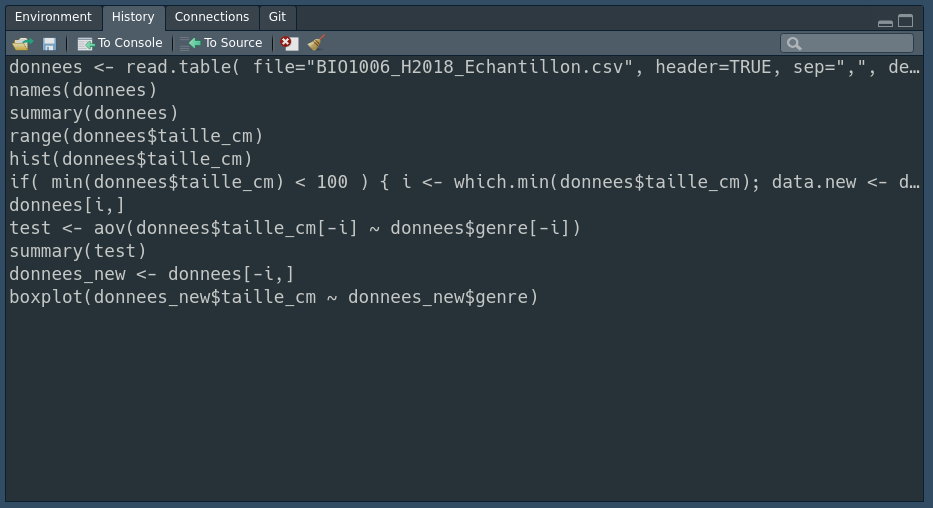
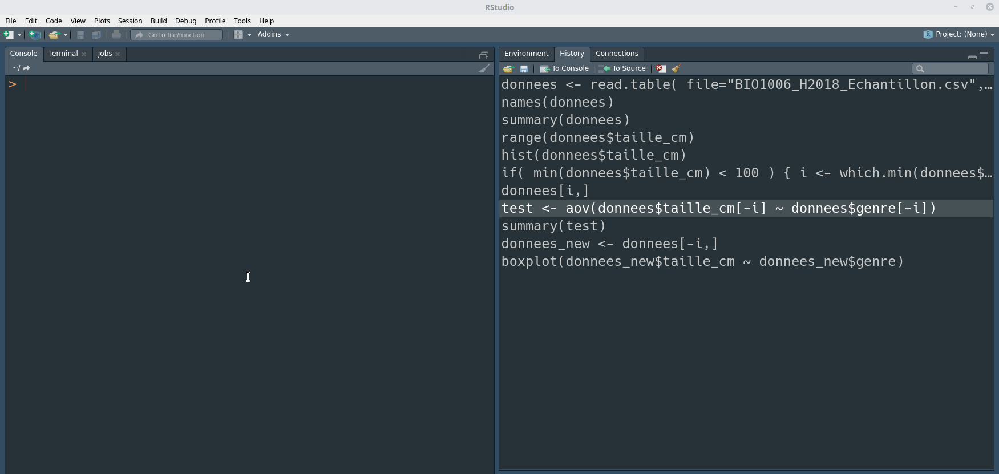
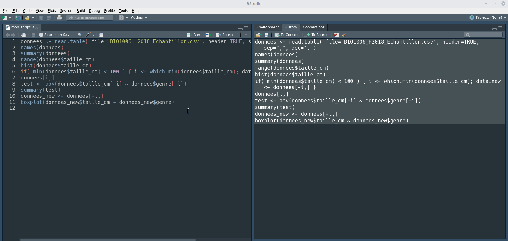



```{r}
#| label: setup
#| echo: false
library(checkdown)
```

## Objectifs de la capsule

À la fin de cette capsule, vous serez en mesure de:

1. Comprendre ce qu’est un script et son utilité
2. Comprendre la trinité du bon script: clair, organisé et commenté
3. Optimiser l’utilisation des panneaux de l’interface Rstudio.

## Capsule vidéo



[Télécharger le script R de la vidéo](www/capsule_5.R) (Faire bouton droit -> enregistrer sous...)

## Exercices

<small>
*Veuillez noter qu’il est possible d’avoir plus d’une bonne réponse par question. Vous pouvez reprendre chaque exercice grâce aux boutons "Start Over" ou "Try Again" Le bouton "hint"" est là pour être utilisé!*
</small>

### Les scripts dans R

::: {.callout-note appearance="simple" icon=false .question}

```{r}
#| label: question1
#| echo: false
#| results: "asis"
check_question(
  c("#"),
  options = c("#", "//", "$", "%"),
  type = "radio",
  button_label = "Vérifier",
  right = "✅ Correct !  Il n'y a que le signe `#` qui permette de commenter du texte en R. Cela fait partie de la syntaxe propre à ce langage et il n'y a pas d'autre choix que de l'apprendre par coeur!",
  wrong = "❌ Incorrect.  Il n'y a que le signe `#` qui permette de commenter du texte en R. Cela fait partie de la syntaxe propre à ce langage et il n'y a pas d'autre choix que de l'apprendre par coeur!",
  title = "Quel est le bon signe à utiliser pour commenter du code en R?"
)
```

:::

::: {.callout-note appearance="simple" icon=false .question}

```{r}
#| label: question2
#| echo: false
#| results: "asis"
check_question(
  c(
    "Garder une trace de ce qui a été fait.",
    "Assurer la reproductibilité de notre analyse."
  ),
  options = c(
    "Garder une trace de ce qui a été fait.",
    "Assurer la reproductibilité de notre analyse.",
    "Sauvegarder des résultats d’analyses.",
    "Enregistrer des données à analyser."
  ),
  type = "checkbox",
  button_label = "Vérifier",
  right = "✅ Correct !  L'utilité principale d'un script est la reproductibilité des analyses, mais ne se limite pas à ça! Il permet également d'organiser notre travail et de le commenter en détail.",
  wrong = "❌ Incorrect.  L'utilité principale d'un script est la reproductibilité des analyses, mais ne se limite pas à ça! Il permet également d'organiser notre travail et de le commenter en détail.",
  title = "Quelles sont les utilités d’un script R?"
)
```

:::

::: {.callout-note appearance="simple" icon=false .question}

```{r}
#| label: question3
#| echo: false
#| results: "asis"
check_question(
  c(".R"),
  options = c(".R", ".r", ".txt", ".script"),
  type = "radio",
  button_label = "Vérifier",
  right = "✅ Correct !  L'extension `.R` est la plus utilisée (et reconnue) pour sauvegarder des scripts R.",
  wrong = "❌ Incorrect.  Les extensions ne sont pas si importantes que ça pour des fichiers textes comme des scripts R, mais certaines applications très utiles comme RStudio vont reconnaitre automatiquement un fichier `*.R` comme étant un script. Cela nous facilite la tâche!",
  title = "Quelle extension de fichier est généralement préférée pour sauvegarder les scripts R?"
)
```

:::

::: {.callout-note appearance="simple" icon=false .question}

```{r}
#| label: question4
#| echo: false
#| results: "asis"
check_question(
  c(
    "Pour le rendre plus clair.",
    "Justifier certains choix qui ne seraient pas évidents (ex.: suppression de valeurs aberrantes."
  ),
  options = c(
    "Pour le complexifier",
    "Pour le rendre plus clair.",
    "Pour que R comprenne exactement ce que l’on veut faire.",
    "Justifier certains choix qui ne seraient pas évidents (ex.: suppression de valeurs aberrantes."
  ),
  type = "checkbox",
  button_label = "Vérifier",
  right = "✅ Correct !  Clarifier la lecture du code et justifier nos choix sont les deux raisons principales pour commenter notre code. On peut également en profiter pour donner des exemples et des références, entre autres.",
  wrong = "❌ Incorrect.  Clarifier la lecture du code et justifier nos choix sont les deux raisons principales pour commenter notre code. On peut également en profiter pour donner des exemples et des références, entre autres.",
  title = "Pourquoi est-il important de commenter son code?"
)
```

:::

::: {.callout-note appearance="simple" icon=false .question}

```{r}
#| label: question5
#| echo: false
#| results: "asis"
check_question(
  c("Oui"),
  options = c("Oui", "Non"),
  type = "radio",
  button_label = "Vérifier",
  right = "✅ Correct !  Il est facile de transférer des lignes de code déjà exécutées vers un script en utilisant le bouton *To Source* de la fenêtre d'historique de RStudio.",
  wrong = "❌ Incorrect.  Il est facile de transférer des lignes de code déjà exécutées vers un script en utilisant le bouton *To Source* de la fenêtre d'historique de RStudio.",
  title = "Peut-on récupérer facilement des lignes d’instructions déjà exécutées et les ajouter à un script dans RStudio?"
)
```

:::

::: {.callout-note appearance="simple" icon=false .question}

```{r}
#| label: question6
#| echo: false
#| results: "asis"
check_question(
  c("Ctrl + Shift + A"),
  options = c("Ctrl + Shift + A", "Ctrl + C", "Alt + Ctrl + D"),
  type = "radio",
  button_label = "Vérifier",
  right = "✅ Correct !  Bien que ce ne soit pas obligatoire (contrairement à d'autres langages de programmation, comme python), c'est fortement conseillé pour la clarté de la lecture et de la compréhension du code.",
  wrong = "❌ Incorrect.  Vérifiez dans le menu Code de RStudio quel est le raccourci clavier pour indenter automatiquement un bloc de code.",
  title = "Dans RStudio, quel est le raccourci clavier par défaut qui permet d’indenter automatiquement un bloc de code?"
)
```

:::
Modifier le code suivant pour qu'il fonctionne correctement.

```{webr}
#| autorun: false
Générer 100 nombres aléatoirement
x <- rnorm(100)

Calculer la moyenne du vecteur x
mean(x)
```

::: {.callout-tip collapse="true"}

### Indice

Le charactère `#` est utilisé pour commenter du code en R. Les ligne de texte qui suivent un `#` ne seront pas exécutées.
:::

::: {.callout-warning collapse="true"}

### Solution

```{r}
#| echo: True
# Générer 100 nombres aléatoirement
x <- rnorm(100)

# Calculer la moyenne du vecteur x
mean(x)
```

:::

## Matériel accompagnateur

### Création d'un script

Afin d'optimiser son travail dans R et de s'assurer au maximum de sa reproductibilité par quelqu'un d'autre, ou par soi-même dans le futur, le script est un outil essentiel! Un script R est simplement un fichier texte portant l'extension **.R** et peut être vu comme une recette: il regroupe, dans un ordre logique et précis, les différentes étapes à exécuter pour réaliser un ensemble de tâches dans le but d'obtenir un résultat identique à chaque fois.

Ainsi, un script permet d'organiser son travail, de le commenter, de le compléter de façon itérative et même de détecter facilement certaines erreurs.

Supposons les commandes R suivantes qui auraient été tapées dans la console pour explorer les résultats du sondage effectué dans le cours de biostatistiques BIO-1006 du programme de baccalauréat en Biologie de l’Université Laval.

```{r, eval=FALSE, echo=TRUE, comment=NA}
donnees <- read.table(file = "BIO1006_H2018_Echantillon.csv", header = TRUE, sep = ",", dec = ".")
names(donnees)
summary(donnees)
range(donnees$taille_cm)
hist(donnees$taille_cm)
if (min(donnees$taille_cm) < 100) {
  i <- which.min(donnees$taille_cm)
  data.new <- donnees[-i, ]
}
donnees[i, ]
test <- aov(donnees$taille_cm[-i] ~ donnees$genre[-i])
summary(test)
donnees_new <- donnees[-i, ]
boxplot(donnees_new$taille_cm ~ donnees_new$genre)
```

Dans RStudio, l'historique de ces commandes est affiché dans la fenêtre _History_.



À ce stade, ces commandes ne font pas encore partie d'un script R. Pour créer un script à partir de notre historique de commandes:

1. Créer un nouveau script (File -> New File -> R Script).
2. Sélectionner les commandes de l'historique que nous désirons envoyer dans le script.
3. Cliquer sur le bouton _To Source_ pour copier les commandes dans le script qui été créé.
4. Sauvegarder le script dans un fichier portant l'extension **.R**. Comme pour les noms de variables, il est important de choisir un nom de fichier représentatif. Cela vous aidera à vous retrouver lorsque votre projet contiendra plusieurs scripts. Par exemple, ici un bon choix aurait pu être `exploration_sondage_bio1006.R`.



### Indentation du code

Indenter correctement le code d'un script fait partie des bonnes pratiques que vous devriez mettre en oeuvre lorsque vous développez du code R. Bien que l'indentation ne soit pas nécessaire d'un point de vue technique, elle vous aidera à mieux lire votre code et vous permettra de repérer les erreurs potentielles.

::: {.callout-tip}
Un bon style de codage équivaut à utiliser une ponctuation correcte. Vous pouvez vous en passer, mais cela rend les choses plus faciles à lire.[^1]
:::

[^1]: http://r-pkgs.had.co.nz/style.html

Dans l'exemple qui suit, on constate que la deuxième version est plus facile à lire, voire à comprendre!

```{r, eval=FALSE, echo=TRUE, comment=NA}
# Fonctionne, mais plus difficile à lire
average <- mean(feet / 12 + inches, na.rm = TRUE)

# Le code est maintenant plus aéré, ce qui facilite sa lecture
average <- mean(feet / 12 + inches, na.rm = TRUE)
```

Reprenons le bloc de code lié à l'exploration des données du sondage.

```{r, eval=FALSE, echo=TRUE, comment=NA}
donnees <- read.table(file = "BIO1006_H2018_Echantillon.csv", header = TRUE, sep = ",", dec = ".")
names(donnees)
summary(donnees)
range(donnees$taille_cm)
hist(donnees$taille_cm)
if (min(donnees$taille_cm) < 100) {
  i <- which.min(donnees$taille_cm)
  data.new <- donnees[-i, ]
}
donnees[i, ]
test <- aov(donnees$taille_cm[-i] ~ donnees$genre[-i])
summary(test)
donnees_new <- donnees[-i, ]
boxplot(donnees_new$taille_cm ~ donnees_new$genre)
```

On constate que le code est très compact et difficile à lire. Heureusement, RStudio peut nous aider à indenter correctement ce bloc de code. Pour ce faire, il suffit de sélectionner les lignes de code à indenter et d'utiliser la combinaison de touches _Ctrl + Shift + A_.



Le code nouvellement formaté devrait ressembler à ceci.

```{r, eval=FALSE, echo=TRUE, comment=NA}
donnees <-
  read.table(
    file = "BIO1006_H2018_Echantillon.csv",
    header = TRUE,
    sep = ",",
    dec = "."
  )
names(donnees)
summary(donnees)
range(donnees$taille_cm)
hist(donnees$taille_cm)
if (min(donnees$taille_cm) < 100) {
  i <- which.min(donnees$taille_cm)
  data.new <- donnees[-i, ]
}
donnees[i, ]
test <- aov(donnees$taille_cm[-i] ~ donnees$genre[-i])
summary(test)
donnees_new <- donnees[-i, ]
boxplot(donnees_new$taille_cm ~ donnees_new$genre)
```

### Commenter le code

Les commentaires sont essentiels et rendent le code plus clair. Il est donc très important de commenter votre code afin de garder une trace de ce qui a été fait. Dans R, un commentaire est une ou plusieurs lignes de texte ignorée(s) lors de l'exécution du script.

Dans R, un commentaire est une ou plusieurs séquences de texte ignorée(s) lors de l'exécution du script qui débute par le signe `#`. Tout ce qui suit ce signe sera donc ignoré lors de l’exécution. Un commentaire peut soit être placé en haut ou à droite d’une ligne de commande.

```{r, echo=TRUE}
# Ceci est une ligne de commentaire et ne sera pas exécuté
x <- 2

x <- 2 # Ceci est aussi un commentaire.
```

Un commentaire devrait posséder les caractéristiques suivantes:

1. Faciliter la lecture du code.
2. Justifier certains choix qui ne seraient pas évidents (ex.: suppression de valeurs aberrantes).
3. Donner un exemple pour permettre de mieux comprendre ce que fait le code.
4. Être concis et ne pas décrire une évidence.
5. Clarifier certaines sections complexes du code. C'est d'ailleurs une indication que votre code est peut-être trop complexe et mériterait d'être revu.

En appliquant ces recommandations générales, le code d'exploration des données du sondage du cours biostasitiques devient plus clair.

```{r, echo=TRUE, eval=TRUE, comment=NA}
# Étape 1: Lire le fichier de données (voir capsule #4) Il s'agit du résultat
# d'un sondage dans une classe d'étudiants de biostatistiques
donnees <- read.table(file = "../data/BIO1006_H2018_Echantillon.csv", header = TRUE, sep = ",", dec = ".")

# Étape 2: Vérifier les types de données et leurs valeurs (voir capsule #2) On
# remarque une valeur aberrante pour la taille en cm des individus!
summary(donnees)

range(donnees$taille_cm)

# Étape 3: Faire un histogramme pour voir la distribution de fréquence des ces
# valeurs numériques (voir capsule #6)
hist(donnees$taille_cm)

# Étape 4: Identifier l'indice de la taille minimale SI elle est INFÉRIEURE à
# 100 cm, puis supprimer cette valeur des futures analyses
if (min(donnees$taille_cm) < 100) {
  # Retrouver l'indice de la valeur aberrante
  i <- which.min(donnees$taille_cm)

  # Créer un nouveau "data frame" sans les valeurs correspondantes
  donnees_new <- donnees[-i, ]
}

# Étape 5: Faire une comparaison de moyennes entre les valeurs de tailles selon
# le facteur "genre"

# Boxplot exploratoire des données
boxplot(donnees_new$taille_cm ~ donnees_new$genre)

# analyse de variance
res.anova <- aov(donnees_new$taille_cm ~ donnees_new$genre)

# Visualisation des résultats de l'anova
summary(res.anova)

# Vérification visuelle des conditions d'application du test
plot(res.anova)
```

### Téléchargement

Le matériel pédagogique utilisé dans cette capsule est disponible pour le téléchargement sous deux formats différents:

1. Format PDF standard que vous pouvez consulter et commenter avec Adobe Reader par exemple.
2. Format HTML dynamique qui se comporte comme une page web et doit être lu avec votre navigateur préféré (Chrome, Firefox, Edge, Safari, etc.).

Pour télécharger le fichier localement sur votre ordinateur, tablette ou téléphone portable, il suffit de cliquer sur le lien désiré avec le bouton droit de votre souris et choisir "sauvegarder sous...".

- [Télécharger la documentation sous format PDF](www/capsule_5.pdf)
- [Télécharger la documentation sous format HTML](www/capsule_5.html)
