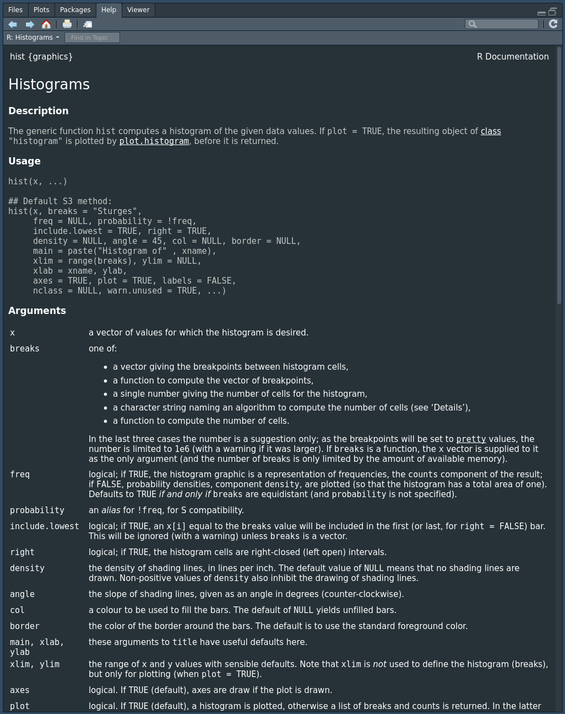
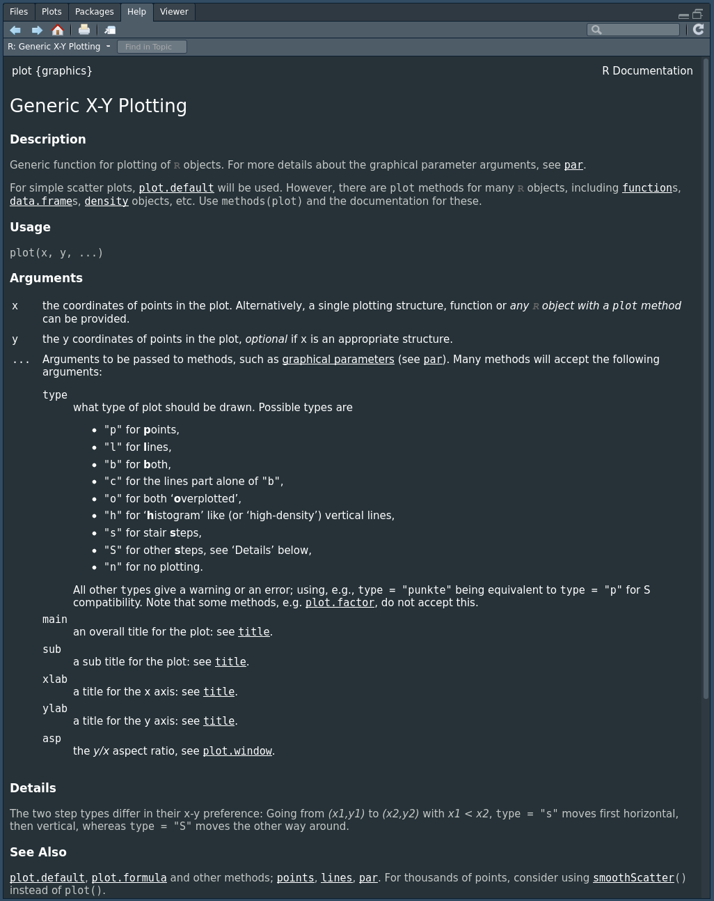



```{r}
#| label: setup
#| echo: false
library(checkdown)
```

## Objectifs de la capsule

À la fin de cette capsule, vous serez en mesure de:

1. Utiliser les options les plus courantes pour chaque type de graphique.
2. Ajouter des couleurs.
3. Ajouter des points et des lignes (abline).
4. Ajouter du texte.
5. Ajouter une légende.
6. Combiner plusieurs graphiques dans un seul.

## Capsule vidéo



## Exercices

::: {.callout-note}
Veuillez noter qu’il est possible d’avoir plus d’une bonne réponse par question. Vous pouvez reprendre chaque exercice grâce aux boutons "Start Over". Le bouton "Indice" est là pour être utilisé!
:::

::: {.callout-note appearance="simple" icon=false .question}

```{r}
#| label: question1
#| echo: false
#| results: "asis"
check_question(
  c("cex"),
  options = c("lty", "bty", "cex", "size"),
  type = "radio",
  button_label = "Vérifier",
  right = "✅ Correct ! Le paramètre numérique cex permet de changer la taille des points (ex.: plot(1, cex = 12)).",
  wrong = "❌ Incorrect. Utilisez l'aide de R pour trouver le bon paramètre à utiliser.",
  title = "Dans un graphique R, quel est le paramètre à utiliser pour ajuster la taille des points?"
)
```

:::

::: {.callout-note appearance="simple" icon=false .question}

```{r}
#| label: question2
#| echo: false
#| results: "asis"
check_question(
  c("pch"),
  options = c("lty", "bty", "pch", "shape"),
  type = "radio",
  button_label = "Vérifier",
  right = "✅ Correct ! Le paramètre numérique pch permet de changer le symbole des points (ex.: plot(1, pch = 22)).",
  wrong = "❌ Incorrect. Utilisez l'aide de R pour trouver le bon paramètre à utiliser.",
  title = "Dans un graphique R, quel est le paramètre à utiliser pour changer le symbole des points?"
)
```

:::

::: {.callout-note appearance="simple" icon=false .question}

```{r}
#| label: question3
#| echo: false
#| results: "asis"
check_question(
  c("col"),
  options = c("color", "col", "fill", "colour"),
  type = "radio",
  button_label = "Vérifier",
  right = "✅ Correct ! Le paramètre col permet de changer la couleur de remplissage des barres (ex.: barplot(1, col = 'red')).",
  wrong = "❌ Incorrect. Utilisez l'aide de R pour trouver le bon paramètre à utiliser.",
  title = "Dans un histogramme, quel paramètre doit-on utiliser pour changer la couleur de remplissage des barres?"
)
```

:::

::: {.callout-note appearance="simple" icon=false .question}

```{r}
#| label: question4
#| echo: false
#| results: "asis"
check_question(
  c("xlab", "ylab"),
  options = c("xlab", "ylab", "labels", "labs"),
  type = "checkbox",
  button_label = "Vérifier",
  right = "✅ Correct ! Les paramètres xlab et ylab permettent de changer le nom des axises (ex.: plot(1, xlab = 'yolo', ylab = 'lol')).",
  wrong = "❌ Incorrect. Utilisez l'aide de R pour trouver le bon paramètre à utiliser.",
  title = "Quels paramètres peuvent être modifiés pour changer les noms des axes dans un graphique?"
)
```

:::

::: {.callout-note appearance="simple" icon=false .question}

```{r}
#| label: question5
#| echo: false
#| results: "asis"
check_question(
  c("main"),
  options = c("title", "main", "titre"),
  type = "radio",
  button_label = "Vérifier",
  right = "✅ Correct ! Le paramètre main permet de changer le titre d'un graphique (ex.: hist(rnorm(100), main = 'Mon super titre')).",
  wrong = "❌ Incorrect. Utilisez l'aide de R pour trouver le bon paramètre à utiliser.",
  title = "Quel paramètre doit-on utiliser pour ajouter un titre dans un graphique?"
)
```

:::

::: {.callout-note appearance="simple" icon=false .question}

```{r}
#| label: question6
#| echo: false
#| results: "asis"
check_question(
  c("abline()"),
  options = c("line()", "segment()", "abline()", "path()"),
  type = "checkbox",
  button_label = "Vérifier",
  right = "✅ Correct ! La fonction abline() permet d'ajouter une droite à un graphique (ex.: plot(1); abline(a = 0, b = 1)).",
  wrong = "❌ Incorrect. Utilisez l'aide de R pour trouver la bonne fonction à utiliser.",
  title = "Quelle est la fonction qui permet d’ajouter une droite (verticale, horizontale ou de régression) dans un graphique?"
)
```

:::

::: {.callout-note appearance="simple" icon=false .question}

```{r}
#| label: question7
#| echo: false
#| results: "asis"
check_question(
  c("lwd"),
  options = c("width", "lwd", "lty", "size"),
  type = "radio",
  button_label = "Vérifier",
  right = "✅ Correct ! Le paramètre lwd (line width) permet de changer l'épaisseur d'une ligne dans un graphique (ex.: plot(1:100, type = 'l', lwd = 10)).",
  wrong = "❌ Incorrect. Utilisez l'aide de R pour trouver le bon paramètre à utiliser.",
  title = "Quel paramètre permet de changer l’épaisseur d’une ligne dans un graphique?"
)
```

:::

::: {.callout-note appearance="simple" icon=false .question}

```{r}
#| label: question8
#| echo: false
#| results: "asis"
check_question(
  c("points()", "lines()"),
  options = c("point()", "points()", "lines()", "line()", "add()"),
  type = "checkbox",
  button_label = "Vérifier",
  right = "✅ Correct ! Les fonctions points() et lines() permettent d'ajouter plusieurs séries de données dans un graphique (ex.: plot(1:10, 1:10); lines(1:10, 1:10*2)).",
  wrong = "❌ Incorrect. Regardez les exemples dans l'aide de R (?plot) pour vous aider.",
  title = "Il est possible d’ajouter plusieurs séries de données dans un graphique. Quelle(s) fonction(s) permet(tent) de faire afficher une seconde série de données?"
)
```

:::

::: {.callout-note appearance="simple" icon=false .question}

```{r}
#| label: question9
#| echo: false
#| results: "asis"
check_question(
  c("par(mfrow = c(3, 2))"),
  options = c("par(mfrow = c(6, 1, 2))", "par(mfrow = c(3, 2))", "par(mfrow = c(2, 3))"),
  type = "radio",
  button_label = "Vérifier",
  right = "✅ Correct ! Les fonctions par() et mfrow() permettent permettent de contrôler comment plusieurs graphiques sont présentés sur une page.",
  wrong = "❌ Incorrect. Utilisez l'aide de R (?par) pour trouver la bonne fonction à utiliser.",
  title = "Parmi les choix suivants, lequel permet de créer un graphique contenant 6 panneaux distribués selon 3 lignes et 2 colonnes?"
)
```

:::

::: {.callout-note appearance="simple" icon=false .question}

```{r}
#| label: question10
#| echo: false
#| results: "asis"
check_question(
  c("mar"),
  options = c("margin", "mar", "marge"),
  type = "radio",
  button_label = "Vérifier",
  right = "✅ Correct ! La fonction mar() permet de contrôler l'espace autours d'un graphique. (ex.: par(mar = c(20, 3, 3, 3)); plot(1)).",
  wrong = "❌ Incorrect. Utilisez l'aide de R pour trouver la bonne fonction à utiliser.",
  title = "Quelle fonction permet de contrôler la marge autour des graphiques?"
)
```

:::

## Matériel accompagnateur

### Modifier le format par défaut des graphiques: pourquoi?

Une fois que nous avons un graphique, il est souvent avantageux de modifier le format par défaut, et ce pour plusieurs raisons. Premièrement, nous voulons présenter les données de la façon la plus claire possible, ce qui n’est pas toujours le cas avec les valeurs par défaut. Par exemple, des points peuvent se chevaucher sur un graphique de nuages de points, ou le nombre de classes par défaut d’un histogramme peuvent ne pas présenter adéquatement la distribution de fréquence des données. Deuxièmement, les standards requis pour inclure un graphique dans un travail ou une publication ne sont pas toujours atteints avec les valeurs par défaut. En effet, nous voulons avoir le titre et les axes les plus clairs possibles, sans avoir à faire des changements manuellement plus tard dans un autre logiciel.

Ces paramètres qui précisent les options de visualisation doivent être ajoutées à la fonction de base que nous tapons pour obtenir un graphique.

Si on veut modifier le format des symboles d’un graphique à nuage de points, on invoque la fonction de base plot() et on y ajoute les options, ici pour la forme des symboles pch.

```{r}
#| echo: True
#| eval: False
#| comment: NA
plot(x, y, pch = 16)
```

Nous verrons des exemples avec les graphiques de base que vous avez déjà explorés, soit l’histogramme, le nuage de point, le graphique à moustache et le barplot.

### La puissance de la fonction d’aide

Il n'y a pas d’avantage à retenir par coeur toutes les options qui s’offrent à vous pour la modification d’un graphique dans R. Faites comme les pros et servez-vous de la fonction d’aide pour aller chercher les paramètres optionnels:

```{r}
#| echo: True
#| eval: False
#| comment: NA
# Pour connaître les paramètres pour la fonction histogramme
?hist
```



```{r}
#| echo: True
#| eval: False
#| comment: NA
# Pour connaître les paramètres des graphiques en nuage de points
?plot
```



### Le cas spécial des couleurs

R nous donne la possibilité de choisir parmi un grand nombre de couleurs pour nos graphiques. On utilise l’argument `col = "nom_de_la_couleur"` pour préciser notre choix (en anglais: "blue", "red", etc.). La palette disponible est assez large. Les noms des couleurs possibles sont présentés dans le document _Colors_ in R à l’adresse suivante:

- http://www.stat.columbia.edu/~tzheng/files/Rcolor.pdf

On peut donc utiliser `col = "darkturquoise"` ou `col = "darkorange"` et sortir des sentiers battus!

Une façon plus avancée de choisir une palette de couleurs est d’utiliser la librairie `RColorBrewer`. Si cette option vous intéresse, il faut tout d’abord installer la librairie dans R.

```{r}
#| echo: True
#| eval: False
#| comment: NA
# Installer la librairie
install.packages("RColorBrewer")
```

Il faut ensuite la charger dans notre session de R lorsqu’on veut s’en servir.

```{r}
#| echo: True
#| eval: True
library(RColorBrewer)
```

On peut ensuite voir les choix de palette de couleurs et choisir le nom de la palette à utiliser

```{r}
#| echo: True
#| eval: True
#| fig.height: 10
display.brewer.all()
```

Utilisez help(RColorBrewer) pour en apprendre plus sur son utilisation.

### Les histogrammes

Nous allons tester différentes modifications aux graphiques de base en utilisant le jeu de données Loblolly, qui est déjà pré-téléchargé dans la version de base de R. Celui-ci contient les données de taille (height, en pieds, une variable numérique) et d’âge (age, en années, une autre variable numérique) pour des pins (_Pinus taeda_) provenant de différents parents (Seed, une variable de type “facteur” où le chiffre représente la paire d’arbres parentaux).

On importe le jeu de données avec la fonction data().

```{r}
#| echo: True
#| eval: True
data("Loblolly")
```

On peut utiliser la fonction head() pour vérifier le contenu de notre jeu de données.

```{r}
#| echo: True
#| eval: True
head(Loblolly)
```

Nous allons créer un histogramme pour ensuite le modifier et illustrer les différentes options qui s’offrent à nous.

```{r}
#| echo: True
#| eval: True
# Construire un histogramme de base avec la taille des arbres
hist(Loblolly$height)
```

On peut modifier cet histogramme présentant la distribution de fréquence des tailles en améliorant les étiquettes des axes avec les paramètres xlab pour l’étiquette des abscisses et ylab pour l’étiquette des ordonnées.

```{r}
#| echo: True
#| eval: True
hist(Loblolly$height, xlab = "Taille en pieds", ylab = "Fréquence")
```

Le titre de notre histogramme peut aussi être modifié avec le paramètre main.

```{r}
#| echo: True
#| eval: True
hist(
  Loblolly$height,
  xlab = "Taille en pieds",
  ylab = "Fréquence",
  main = "Distribution de fréquence des tailles de Pinus taeda"
)
```

On peut également ajouter un sous-titre avec le paramètre sub.

```{r}
#| echo: True
#| eval: True
hist(
  Loblolly$height,
  xlab = "Taille en pieds",
  ylab = "Fréquence",
  main = "Distribution de fréquence des tailles de Pinus taeda",
  sub = "Ceci est mon super sous-titre"
)
```

On peut ajouter la distribution de chacune des valeurs du jeu de données pour cette variable avec la fonction rug() invoquée après avoir déjà créé l’histogramme.

```{r}
#| echo: True
#| eval: True
hist(
  Loblolly$height,
  xlab = "Taille en pieds",
  ylab = "Fréquence",
  main = "Distribution de fréquence des tailles de Pinus taeda"
)

rug(Loblolly$height)
```

On peut finalement ajouter la valeur de la médiane à l’aide de la fonction abline(). On peut spécifier la valeur utilisée pour tracer la ligne verticale avec le paramètre v, la couleur de la ligne verticale avec col et sa largeur avec lwd.

```{r}
#| echo: True
#| eval: True
hist(
  Loblolly$height,
  xlab = "Taille en pieds",
  ylab = "Fréquence",
  main = "Distribution de fréquence des tailles de Pinus taeda"
)

abline(v = median(Loblolly$height), col = "red", lwd = 4)
```

### Les graphiques en nuage de points

Comme nous l’avons vu précédemment, les graphiques en nuage de points peuvent servir à voir la relation entre deux variables. Commençons par voir s’il y a une relation entre la taille des arbres et leur âge.

```{r}
#| echo: True
#| eval: True
# Graphique de la taille (axe des y) en fonction de l’âge (axe des x)
plot(Loblolly$age, Loblolly$height)
```

C’est bien, mais pourrait-on modifier l’apparence du symbole des points? C’est possible en utilisant le paramètre pch. On peut avoir des symboles pleins ou vides, ou modifier la forme.

```{r}
#| echo: True
#| eval: True
# changer les symboles pour des symboles de cercle pleins noirs
plot(Loblolly$age, Loblolly$height, pch = 16)
```

Il y a de nombreux symboles possibles, explorez!

```{r}
#| echo: True
#| eval: True
# Faire le même graphique mais avec des étoiles comme symbole
plot(Loblolly$age, Loblolly$height, pch = 42)
```

Il est aussi possible de modifier la taille des symboles, avec le paramètre cex.

```{r}
#| echo: True
#| eval: True
# On augment la taille des symboles
plot(Loblolly$age, Loblolly$height, pch = 42, cex = 2)
```

Ces arbres proviennent de différentes familles (la variable `Loblolly$Seed` qui est un facteur). Il est possible que leur famille d’origine affecte leur croissance. On pourrait utiliser les couleurs pour visualiser séparément les différentes familles. Pour y arriver, on spécifie que l’option de couleur `col` doit représenter la variable `Loblolly$Seed`.

```{r}
#| echo: True
#| eval: True
# Spécifier la couleur avec une variable qui est un facteur
plot(Loblolly$age, Loblolly$height, pch = 16, col = Loblolly$Seed)
```

Vous pouvez donc utiliser une variable en format facteur car elle permet de grouper les données pour déterminer la couleur à utiliser, comme par exemple selon la population d’origine, ou un groupe contrôle et un groupe traité, l’année de récolte des données, ou bien le sexe des individus.

### Les graphiques à moustache

Il est possible de modifier la couleur des graphiques à moustache. Par exemple, on pourrait vouloir que celui-ci soit dessiné en turquoise, ce que l’on précise avec `col = "nom de la couleur"`

```{r}
#| echo: True
#| eval: True
boxplot(height ~ age, data = Loblolly, col = "darkturquoise")
```

On pourrait aussi plutôt modifier la couleur du tracé

```{r}
#| echo: True
#| eval: True
boxplot(height ~ age, data = Loblolly, border = "darkorange")
```

Voici un graphique aide-mémoire pour vous aider avec les différents paramètres de base pour modifier vos graphiques.

```{r}
#| echo: False
#| fig.align: 'center'

# initialization
par(mar = c(3, 3, 3, 3))
num <- 0
num1 <- 0
plot(0, 0, xlim = c(0, 21), ylim = c(0.5, 6.5), col = "white", yaxt = "n", ylab = "", xlab = "")

# fill the graph
for (i in seq(1, 20)) {
  points(i, 1, pch = i, cex = 3)
  points(i, 2, col = i, pch = 16, cex = 3)
  points(i, 3, col = "black", pch = 16, cex = i * 0.25)

  # lty
  if (i %in% c(seq(1, 18, 3))) {
    num <- num + 1
    points(c(i, i + 2), c(4, 4), col = "black", lty = num, type = "l", lwd = 2)
    text(i + 1.1, 4.15, num)
  }

  # type and lwd
  if (i %in% c(seq(1, 20, 5))) {
    num1 <- num1 + 1
    points(c(i, i + 1, i + 2, i + 3), c(5, 5, 5, 5), col = "black", type = c("p", "l", "b", "o")[num1], lwd = 2)
    text(i + 1.1, 5.2, c("p", "l", "b", "o")[num1])
    points(c(i, i + 1, i + 2, i + 3), c(6, 6, 6, 6), col = "black", type = "l", lwd = num1)
    text(i + 1.1, 6.2, num1)
  }
}

# add axis
axis(
  2,
  at = c(1, 2, 3, 4, 5, 6),
  labels = c("pch", "col", "cex", "lty", "type", "lwd"),
  tick = TRUE,
  col = "black",
  las = 1,
  cex.axis = 0.8
)
```

### Légendes

Supposons ce graphique fait avec les données du _data frame_ mtcars. La couleur des points est associée au nombre de cylindres du moteur (cyl).

```{r}
#| echo: True
#| eval: True
plot(mtcars$hp, mtcars$mpg, pch = 16, col = mtcars$cyl)
```

Il serait intéressant de pouvoir ajouter une légende à ce graphique pour identifier à quoi correspondent les couleurs. Pour y arriver, il faut utiliser la fonction legend() après la création du graphique. Cette fonction utilise plusieurs paramètres. Prenez le temps d'explorer par vous-même pour bien comprendre.

```{r}
#| echo: True
#| eval: True
mes_couleurs <- brewer.pal(n = 3, "Set1") # Choisir une palette de couleur
mes_couleurs

# On fait le graphique de base. Ne pas oublier d'utiliser la fonction facteur pour changer la classe de la variable cyl
plot(mtcars$hp, mtcars$mpg, pch = 16, col = mes_couleurs[factor(mtcars$cyl)])

legend(
  x = "bottomleft", # position de la légende
  inset = .02, # Ajustement de la position (pour déplacer légèrement la légende)
  title = "Nombre de cylindre", # Titre de la légende
  c("4", "6", "8"), # Éléments de la légende
  col = unique(mes_couleurs[factor(mtcars$cyl)]), # Couleur des point de la légende
  horiz = TRUE, # On veut une légende horizontale
  pch = 16, # Symboles à utiliser dans la légende
  cex = 0.8 # Grosseur des symboles
)
```

### Droite de régression

Nous avons déjà utilisé la fonction abline pour tracer des lignes verticales. On peut également utiliser cette fonction pour tracer des droites de régression. Nous utiliserons les données iris pour démontrer comment ajouter une telle droite. Dans le graphique suivant, il semble y avoir une relation linéaire entre les variables `Petal.Width` et `Petal.Length`.

```{r}
#| echo: True
#| eval: True
data(iris)
plot(iris$Petal.Width, iris$Petal.Length)
```

Pour ajouter une droite de régression, il faut d'abord faire un modèle linéaire à l'aide de la fonction lm (_linear model_ en anglais). Lorsque le modèle est fait, on peut utiliser la fonction abline(modele) pour ajouter la droite de régression [^1].

[^1]: Voir la capsule statistique portant sur les modèles linéaire.

```{r}
#| echo: True
#| eval: True
mod <- lm(Petal.Length ~ Petal.Width, data = iris)

plot(iris$Petal.Width, iris$Petal.Length)
abline(mod, col = "red")
```

### Ajout de courbes

Jusqu'à maintenant, nous avons seulement affiché une série de données dans nos graphiques. Il est souvent intéressant de pouvoir visualiser plusieurs courbes dans un seul graphique. Pour y arriver, il suffit d'utiliser la fonction lines() après l'appel de la fonction plot(). La fonction lines() fonctionne de la même manière que la fonction plot(), à la différence qu'elle doit être utilisée une fois le graphique principale créée.

Nous allons créer un jeu de données pour montrer comment utiliser la fonction lines().

```{r}
#| echo: True
#| eval: True
x <- seq(from = -2 * pi, to = 2 * pi, length.out = 100) # Variable x
y1 <- sin(x) # Première variable y
y2 <- cos(x) # Deuxième variable y

# Afficher la première série
plot(x, y1, col = "lightcoral", type = "l", lty = 2, lwd = 2)

# Ajouter la deuxième série
lines(x, y2, col = "steelblue4", lty = 1, lwd = 2)
```

Évidemment, il est nécessaire d'ajouter une légende pour identifier les deux courbes.

```{r}
plot(x, y1, col = "lightcoral", type = "l", lty = 2, lwd = 2, ylim = c(-1, 1.5))
lines(x, y2, col = "steelblue4", lty = 1, lwd = 2)
legend(
  "topright",
  legend = c("sin(x)", "cos(x)"),
  col = c("lightcoral", "steelblue4"),
  lty = c(2, 1),
  horiz = TRUE,
  bty = "n"
)
```

### Modification des axes

Par défaut, R tentera de placer un nombre de marqueurs sur les axes de manière optimale. Cependant, nous pouvons contrôler comment ils apparaissent. La première étape est de dire à R de ne pas afficher les marqueurs sur l'axe des x avec le paramètre `xaxt = "n"`. La seconde étape est d'utiliser la fonction axis() pour ajouter manuellement l'axe des x. Pour l'axe des x, il faut spécifier `side = 1`. Par la suite, on utilise le paramètre `at = v` où `v` est un vecteur numérique indiquant la position des marqueurs. Dans le cas suivant, on place un marqueur à chaque valeur de l'âge entre 0 et 25.

```{r}
#| echo: True
#| fig.keep: "all"
plot(Loblolly$age, Loblolly$height, pch = 16, xaxt = "n")
axis(side = 1, at = seq(0, 25, by = 2))
```

Finalement, on peut facilement remplacer la valeur des étiquettes en utilisant le paramètre labels dans la fonction axis().

```{r}
#| echo: True
plot(Loblolly$age, Loblolly$height, pch = 16, xaxt = "n")
axis(side = 1, at = c(5, 15, 25), labels = c("A", "B", "C"))
```

### Mise en page de plusieurs graphiques

Dans certains cas, il est peut-être utile de combiner plusieurs graphiques dans un seul. Pour y arriver, il faut utiliser la fonction par() avant de faire les graphiques. C'est avec cette fonction qu'il faut définir comment les graphiques seront présentés. Il existe plusieurs paramètres que l'on peut modifier avec cette fonction, mais les plus fréquentes sont mfrow et mar. Le paramètre mfrow (un vecteur numérique de 2 éléments) permet de spécifier combien de ligne et de colonnes le graphique contiendra. Par exemple, mfrow = c(1, 2) indique un graphique avec 1 ligne et 2 colonnes. Le paramètre mar (un vecteur numérique de 4 éléments) permet de spécifier les marges à utiliser autours de chaque sous-graphiques. Par exemple, mar = c(1, 1, 1, 1) indique d'utiliser une valeur de 1 ligne sur chaque coté des graphiques.

Dans l'exemple suivant, on créer un graphique avec 4 sous-graphiques et on ajouter une légende pour identifier les panneaux A, B, C et D.

```{r}
#| echo: True
# Un graphique avec 4 panneaux (2 lignes * 2 colonnes)
par(mfrow = c(2, 2), mar = c(5, 5, 0, 1))

barplot(mtcars$mpg) # plot 1
legend("topright", "A", bty = "n")

plot(mtcars$hp, mtcars$mpg) # plot 2
legend("topright", "B", bty = "n")

boxplot(mtcars$mpg ~ mtcars$cyl) # plot 3
legend("topright", "C", bty = "n")

hist(mtcars$hp, main = "") # plot 4
legend("topright", "D", bty = "n")
```

### Notation mathématique

En utilisant la fonction bquote() il est possible d'ajouter des symboles mathématiques dans les graphiques. Cette fonction est relativement complexe, on vous invite à consulter l'aide pour bien la comprendre. Voici cependant quelques exemples.

```{r}
#| echo: True
plot(
  1:10,
  1:10,
  xlab = bquote(x^2),
  ylab = bquote("Primary production" ~ (mgC ~ m^{
    -1
  })),
  main = bquote(phi == 3 ~ beta == 5 ~ alpha == 0.4)
)
```
