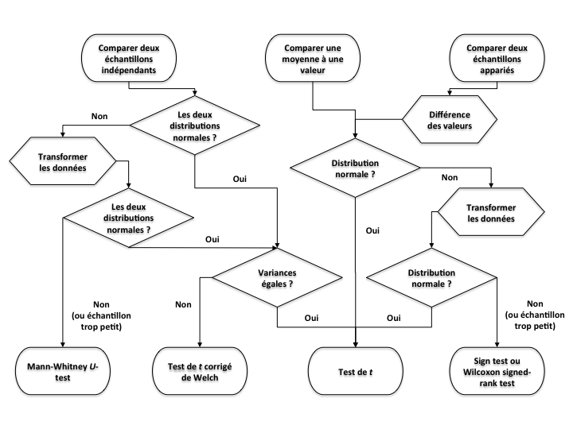



```{r}
#| label: setup
#| echo: false
library(checkdown)
```

## Objectifs de la capsule

À la fin de cette capsule, vous serez en mesure de:

1. Comprendre l'importance de **vérifier les conditions d'application** des tests statistiques paramétriques (normalité, homoscédasticité, etc.),
2. **Transformer des données** et ajouter ces nouvelles variables dans le jeu de données, si nécessaire,
3. Utiliser un **test diagnostique visuel** _a posteriori_ avec la fonction plot().

## Capsule vidéo



## Exercices

::: {.callout-note}
Veuillez noter qu’il est possible d’avoir plus d’une bonne réponse par question. Vous pouvez reprendre chaque exercice grâce aux boutons "Start Over". Le bouton "Indice" est là pour être utilisé!
:::

::: {.callout-note appearance="simple" icon=false .question}

```{r}
#| label: question1
#| echo: false
#| results: "asis"
# FIX: Need to find a way to use ' in the answer. At the moment it crashes when
# there is a ' in the answer. Should report this to the package maintainer.
check_question(
  c("Lorsque les valeurs ne respectent pas toutes les conditions d application, il n y a rien à faire et le test ne peut pas être effectué."),
  options = c(
    "Dans la grande majorité des tests statistiques, les échantillons doivent être indépendants et aléatoires.",
    "Les tests paramétriques imposent des conditions précises quant à la distribution de fréquences des données.",
    "La présence de valeurs extrêmes (outliers) parmi les données d'un échantillon pose en général un problème pour l'analyse statistique.",
    "Lorsque les valeurs ne respectent pas toutes les conditions d application, il n y a rien à faire et le test ne peut pas être effectué."
  ),
  type = "radio",
  button_label = "Vérifier",
  right = "✅ Correct ! Il y a plusieurs stratégies à essayer pour surmonter les violations des conditions d'application.",
  wrong = "❌ Incorrect. Rappelez-vous des stratégies possibles quand les conditions ne sont pas totalement remplies.",
  title = "Choisissez l'affirmation FAUSSE à propos des conditions d'application des tests statistiques paramétriques"
)
```

:::

::: {.callout-note appearance="simple" icon=false .question}

```{r}
#| label: question2
#| echo: false
#| results: "asis"
check_question(
  c("Écart-type"),
  options = c(
    "La variance",
    "Écart-type",
    "Écart des extrêmes"
  ),
  type = "radio",
  button_label = "Vérifier",
  right = "✅ Correct ! L'écart-type est la meilleure mesure pour représenter la dispersion sur un histogramme.",
  wrong = "❌ Incorrect. Pensez à une mesure qui est directement comparable aux données étudiées.",
  title = "Sur un graphique représentant la distribution de fréquence de données d'échantillonnage (un histogramme), le paramètre le plus utile pour représenter leur dispersion est:"
)
```

:::

::: {.callout-note appearance="simple" icon=false .question}

```{r}
#| label: question3
#| echo: false
#| results: "asis"
check_question(
  c("Utiliser un test non-paramétrique pour vérifier si la distribution des valeurs diffère significativement d une distribution uniforme."),
  options = c(
    "Utiliser un test non-paramétrique pour vérifier si la distribution des valeurs diffère significativement d une distribution uniforme.",
    "Utiliser un test de t pour comparer la moyenne de vos mesures à la valeur arbitraire de 180 degrés."
  ),
  type = "radio",
  button_label = "Vérifier",
  right = "✅ Correct ! Un test non-paramétrique est approprié ici car il ne nécessite pas de conditions de Normalité.",
  wrong = "❌ Incorrect. Un test de t serait inapproprié pour de telles données.",
  title = "Votre sujet de stage concerne la capacité des bébés tortues à rejoindre la mer juste après leur éclosion. Comment y perviennent-elles ? La variable “direction des bébés tortues” est quantitative, continue et varie de 0° à 360°. Sachant que 0° = 360°, si la direction prise est aléatoire (hypothèse nulle), alors la distribution de fréquence des valeurs devrait être **uniforme**. Il n'existe **pas de transformation mathématique** adéquate pour *transformer* vos données de façon à ce qu'elles suivent une distribution Normale. Sachant cela, que devriez-vous faire pour identifier si les bébés tortues s'orientent différemment que le hasard ?"
)
```

:::

Même si vous n'êtes pas (encore) familier avec la régression linéaires, sachez que cette opération statistique doit respecter les mêmes conditions d'application que l'ANOVA, plus d'autres qui lui sont spécifiques.

```{r echo=TRUE, eval=TRUE}
data(ChickWeight)
test <- lm(ChickWeight$weight ~ ChickWeight$Time)
plot(test, which = 1)
```

::: {.callout-note appearance="simple" icon=false .question}

```{r}
#| label: question-residus
#| echo: false
#| results: "asis"
check_question(
  c("Il y a un problème d hétéroscédasticité (homogénéité des variances) : plus la valeur prédite par le modèle statistique est grande, plus la variabilité de la variable réponse est grande."),
  options = c(
    "Il y a un biais dans l'échantillonnage qui se reflète sur la relation entre les variables explicative (temps) et réponse (orientation des tortues).",
    "Nous n'avons pas fait assez de mesures pour pouvoir conclure notre test statistique.",
    "Il y a un problème d hétéroscédasticité (homogénéité des variances) : plus la valeur prédite par le modèle statistique est grande, plus la variabilité de la variable réponse est grande."
  ),
  type = "radio",
  button_label = "Vérifier",
  right = "✅ Correct ! Il y a clairement un problème d'homogénéité des variances ici ! Il est évident que la variabilité des résidus augmente avec la prédiction de la régression, ce qui ne DOIT PAS être le cas pour que la condition d'hétéroscédasticité soit respectée.",
  wrong = "❌ Incorrect. Réfléchissez à ce que vous observez dans le graphique diagnostique des résidus.",
  title = "Vous devez donc être capable de décider d'après ce graphique diagnostique des résidus quelle condition d'application de la régression linéaire est violée :"
)
```

:::

Les valeurs de la variable réponse (dépendante) utilisée dans ce test suivent cette distribution de fréquence :

```{r echo=TRUE, eval=TRUE}
hist(ChickWeight$weight, xlab = "Masse (g)", ylab = "Fréquence", main = "Masse des poussins")
```

::: {.callout-note appearance="simple" icon=false .question}

```{r}
#| label: question-distribution
#| echo: false
#| results: "asis"
check_question(
  c("Distribution log-normale"),
  options = c(
    "Distribution Gamma",
    "Distribution Uniforme",
    "Distribution log-normale",
    "Distribution Binomiale"
  ),
  type = "radio",
  button_label = "Vérifier",
  right = "✅ Correct ! Il s'agit bien d'une distribution log-normale.",
  wrong = "❌ Incorrect. Réessayez!",
  title = "D'après vous, de quel type de distribution de fréquence s'agit-il ?"
)
```

:::

::: {.callout-note appearance="simple" icon=false .question}

```{r}
#| label: question-transformation
#| echo: false
#| results: "asis"
check_question(
  c("Logarithmique"),
  options = c(
    "Racine carrée",
    "Racine cubique",
    "Logarithmique"
  ),
  type = "radio",
  button_label = "Vérifier",
  right = "✅ Correct ! Une transformation logarithmique pourrait effectivement permettre d'obtenir une distribution Normale de ces valeurs.",
  wrong = "❌ Incorrect. Réessayez! Pensez au nom de la distribution de la question précédente pour vous aider.",
  title = "Quelle transformation mathématique pourrait-on essayer pour obtenir une distribution Normale de ces valeurs ?"
)
```

:::

Voici un _boxplot_ de groupes de valeurs dont vous voulez comparer les moyennes au moyen d'une ANOVA à un facteur :

```{r echo=TRUE, eval=TRUE}
data("PlantGrowth")
boxplot(PlantGrowth$weight ~ PlantGrowth$group,
  main = "",
  ylab = "Masse sèche des plantes (g) ", col = "lightgray"
)
```

::: {.callout-note appearance="simple" icon=false .question}

```{r}
#| label: question-homogeneite-variances
#| echo: false
#| results: "asis"
check_question(
  c("bartlett.test()"),
  options = c(
    "shapiro.test()",
    "t.test()",
    "TukeyHSD()",
    "bartlett.test()"
  ),
  type = "radio",
  button_label = "Vérifier",
  right = "✅ Correct ! Le test de Bartlett est utilisé pour vérifier l'homogénéité des variances entre les échantillons.",
  wrong = "❌ Incorrect. Réfléchissez au test spécifique pour l'homogénéité des variances.",
  title = "Parmi les fonctions suivantes, laquelle devez-vous utiliser pour tester l'homogénéité des variances entre les échantillons ?"
)
```

:::

Utilisez cette fonction pour faire le test d'homogénéité des variances en utilisant la variable réponse `PlantGrowth$weight` et le facteur de groupe `PlantGrowth$group`. N'oubliez pas que vous pouvez utiliser l'aide de la fonction...

```{webr}

```

::: {.callout-warning collapse="true"}

### Solution

```{r}
#| echo: True
bartlett.test(PlantGrowth$weight ~ PlantGrowth$group)
```

:::

## Matériel accompagnateur

Voici un ensemble de commandes organisées en script (voir capsule #5).

### Charger les données pour l'analyse

::: {.callout-tip}
Tapez InsectSprays dans l'aide de R pour en savoir plus (voir capsule #1).
:::

Il s'agit d'un jeu de données fourni avec R donnant les comptes d'insectes trouvés sur des parcelles traitées avec différents insecticides. On va d'abord charger le jeu de données, puis le rendre accessible en premier plan dans la mémoire de R :

```{r, echo=TRUE, eval=TRUE}
data("InsectSprays")

InsectSprays
```

### Comparer les nombres moyens d'insectes

Ici on veut comparer les nombres moyens d'insectes trouvés après les traitements C et F. Le but de ce test est de vérifier si ces deux types de traitement permettent d'éliminer une quantité d'insectes similaire en moyenne (comparer si les échantillons proviennent de la même "population" statistique).

```{r, echo=TRUE, eval=TRUE}
# Création de groupes pour séparer nos données d'insectes ("count")
T.C <- InsectSprays$spray == "C"
T.F <- InsectSprays$spray == "F"
```

- Vérifier _a priori_ les conditions d'application d'un test de comparaison de moyenne paramétrique

Afin de pouvoir se fier aux conclusions d'un test statistique, il faut s'assurer que nos données respectent les **conditions d'application** du test envisagé.

::: {.callout-tip}
La première condition à vérifier est toujours la même pour tous les tests de base : il faut que les échantillons soient aléatoires et indépendants !
:::

Ensuite, d'autres conditions spécifiques à chaque test doivent être remplies. La figure ci-dessous rappelle les vérifications à faire pour correctement choisir le test de comparaison de moyennes à effectuer sur nos données. Les losanges indiquent les étapes de vérification des conditions d'application de chaque test possible.



Pour un test de comparaison de moyenne paramétrique standard (test de _t_), il faut ainsi vérifier
(i) la **normalité** et (ii) **l'homogénéité des variances** des données de nos deux échantillons.

- Vérifier la normalité des données

On vérifie d'abord visuellement la distribution de fréquence des données :

```{r, echo=TRUE, eval=TRUE}
# Histogrammes pour vérifier la normalité des distributions de valeurs de mass
par(mfrow = c(1, 2))

hist(
  InsectSprays$count[T.C],
  xlim = c(0, 15),
  ylim = c(0, 8),
  xlab = "Nombre d'insectes",
  ylab = "Fréquence des parcelles",
  main = "Traitement C"
)

hist(
  InsectSprays$count[T.F],
  xlim = c(0, 30),
  ylim = c(0, 8),
  xlab = "Nombre d'insectes",
  ylab = "Fréquence des parcelles",
  main = "Traitement F"
)
```

Il apparait évident à l'allure asymétrique des deux distributions de fréquence que les valeurs des deux échantillons ne sont pas normalement distribuées. De plus, la première distribution en particulier fait apparaitre des valeurs extrêmes, très éloignées des autres : ce sont des _outliers_; il faut y apporter une attention particulière (voir ci-dessous). Nous pouvons le confirmer avec un test statistique de Shapiro-Wilk qui compare la distribution de l'échantillon à la distribution nulle Normale : shapiro.test()

```{r, echo=TRUE, eval=TRUE}
shapiro.test(InsectSprays$count[T.C])
shapiro.test(InsectSprays$count[T.F])
```

Dans le premier cas, la valeur de la _p_-values tout juste inférieure au seuil alpha de 0.05 indique que l'on peut rejeter l'hypothèse nulle testée que l'on peut formuler ainsi : "il n'y a pas de différence entre la distribution des valeurs échantillonnées et une distribution Normale". Par contre, malgré l'allure non symétrique de la distribution des valeurs pour le traitement "F", le test ne permet pas de rejeter l'hypothèse nulle. Ceci permet d'insister sur le fait que la vérification visuelle n'est pas toujours évidente; à l'inverse, un test formel n'est parfois pas assez **"puissant"** pour rejeter l'hypothèse nulle. Cela a souvent à voir avec le nombre de valeurs dans l'échantillon. En effet, plus il y a d'observations, plus le test est puissant.

- **Transformer** les valeurs des échantillons

Que peut-on faire lorsque les données ne sont pas distribuées normalement ?

1. Si les données ne dévient "pas trop" de la normalité, **rien**, est une option !
2. Sinon, essayer des **transformations mathématiques** des données, puis faire l'analyse envisagée sur ces données transformées.

Ici, nous travaillons avec des **données qui sont distribuées asymétriquement avec une dominance des faibles valeurs, et quelques fortes valeurs**. Ce type de distribution correspond typiquement à une distribution _log-normale_, c'est-à-dire que les valeurs transformées par un logarithme suivent une distribution Normale. Ceci souvent le cas pour des jeux de données impliquant des masses, volumes, concentrations, taux, etc. La transformation logarithmique a en plus l'avantage de réduire l'influence des valeurs extrêmes (_outliers_ ci-dessus) et d'égaliser les variances (voir ci-dessous). Nous créons donc une nouvelle variable qui servira pour nos analyses de comparaison de moyenne :

```{r, echo=TRUE, eval=TRUE}
logCount <- log10(InsectSprays$count + 1)

# Ajouter la nouvelle variable logCount dans le data frame InsectSprays
InsectSprays$logCount <- logCount
```

::: {.callout-caution}
N'oubliez pas que log(0) n'existe pas ! Donc si vous avez des valeurs nulles, la transformation à faire est log( valeur + 1 ). Soyez attentifs aux spécificités des fonctions mathématiques que vous utilisez.
:::

::: {.callout-caution}
N'oubliez pas de transformer toutes les valeurs de la même façon (pour chaque groupe) dans le cas de comparaisons de moyennes !
:::

- Vérifier l'homogénéité des variances

Encore une fois, on peut se fier à l'allure des distributions de valeurs (d'après l'étendue des valeurs d'un boxplot, par exemple).

```{r, echo=TRUE, eval=TRUE}
boxplot(InsectSprays$logCount ~ InsectSprays$spray, xlab = "Traitement", ylab = "Nombres d'insectes par parcelle")
```

On remarque sur ces boxplots que les distributions des valeurs semblent effectivement plus symétriques (Normales) après transformation, même s'il reste un _outlier_ dans le groupe D. De plus l'étendue des distributions de valeurs transformées semble plutôt similaire entre les groupes. Mais on peut également faire un test formel d'homogénéité des variances :

```{r, echo=TRUE, eval=TRUE}
var.test(InsectSprays$logCount[T.C], InsectSprays$logCount[T.F])
```

La _p_-value > seuil alpha de 0.05 indique que les variances des insectes dénombrés sur les parcelles traitées pour les deux traitements **ne** sont **pas** significativement différentes à un seuil de confiance de 95% (19 fois sur 20). Le résultat du test nous donne par ailleurs le ratio des variances F = 3.13 et sont intervalle de confiance (très large) à 95% (0.90 < F < 10.9) n'exclue pas la **valeur nulle de 1**.

### Test de comparaison de moyennes

Ici on veut faire le test de comparaison de moyennes de façon appropriée. Il faut maintenant prendre en compte les résultats de notre vérification _a priori_ des conditions d'application du test, et faire ce test sur les valeurs transformées. Il faut savoir qu'il y a plusieurs arguments (options) à la fonction `t.test()` pour lesquels nous pouvons préciser la valeur (voir capsule #3). L'aide de la fonction qu'on peut obtenir en tapant `?t.test` dans l'invite de commande nous donne :

```r
## Default S3 method:
t.test(x,
  y = NULL,
  alternative = c("two.sided", "less", "greater"),
  mu = 0, paired = FALSE, var.equal = FALSE,
  conf.level = 0.95, ...
)
```

Ici il y a une (1) option directement reliée à la condition **d'homoscédasticité** (égalité des variances) : `var.equal = ` qui devra indiquer par les valeurs logiques TRUE ou FALSE si on considère que les variances des deux échantillons sont homogènes.

::: {.callout-caution}
La valeur par défaut de cette option est FALSE; donc R fait **par défaut un test corrigé de Welch** !
:::

Dans notre cas, les variances des groupes comparés **sont homogènes**, donc il faut spécifier la valeur suivante lors du test dans R :

```{r, echo=TRUE, eval=TRUE}
t.test(InsectSprays$logCount[T.C], InsectSprays$logCount[T.F], var.equal = TRUE)
```

La _p_-value << 0.05 permet de conclure que ces deux types de traitement conduisent à des nombres d'insectes moyens différents, 19 fois sur 20 (confiance à 95%).

### Vérification _a posteriori_ des conditions d'application

Il s'agit maintenant de vérifier _a posteriori_ les conditions d'application du test statistique paramétrique.

::: {.callout-note}
La vérification des conditions d'application d'un test peut souvent se faire _a priori_ (**avant** l'analyse), mais aussi _a posteriori_ (**après** l'analyse) sur les **résidus**.
:::

Le terme résidus indique essentiellement les valeurs de **l'écart de chaque observation au modèle nul** défini pour le test paramétrique effectué.

Il existe plusieurs tests pour lesquels l'analyse des résidus _a posteriori_ est la meilleure option, comme dans le cas d'une analyse de régression (voir capsule #11). Ici nous prendrons l'exemple d'une analyse de variance sur nos données **de masse des poussins**.

- Comparaison de l'effet des six (6) types de traitement sur la présence d'insectes

Il s'agit ici de comparer les quantités d'insectes moyennes retrouvées sur les parcelles traitées avec chacun des produits. Nous faisons donc, **d'abord sur les données brutes** (non transformées), l'ANOVA suivante (voir capsule #8) :

```{r, echo=TRUE, eval=TRUE}
model <- count ~ spray
analyse <- aov(model, data = InsectSprays)
summary(analyse)
```

La conclusion de ce test **semble claire** : la très faible _p_-value indique que le nombre moyen d'insectes d'au moins un des groupes diffère des autres, 19 fois sur 20 (confiance à 95%). **MAIS POUVONS-NOUS NOUS FIER À CES RÉSULTATS ?** Nous allons évaluer le respect des conditions d'application _a posteriori_ sur les résidus de l'analyse déjà effectuée.

- Vérification **visuelle** des conditions d'application de l'ANOVA

```{r, echo=TRUE, eval=TRUE}
plot(analyse, which = c(1, 2, 4))
```

La fonction plot() reconnait le type de la variable analyse, c'est-à-dire un résultat de test statistique, et elle produit automatiquement plusieurs graphiques diagnostiques (par défaut). On en a choisi trois ici.

1. Le premier représente simplement les valeurs de chaque résidu (écart) en fonction de la valeur "prédite" par le modèle nul testé. Dans le cas de l'ANOVA, il s'agit simplement de la moyenne de groupe ! Ce premier graphique permet déjà de vérifier la normalité des résidus et donc des valeurs : Sont-ils répartis symétriquement de part et d'autre du 0 ? **Ce n'est pas vraiment le cas ici !** Il permet également d'avoir une idée de l'homogénéité des variances : Les étendues des valeurs sont-elles comparables entre les groupes ? **Ça n'est pas le cas non plus**. Finalement, si la droite indicatrice rouge dévie notablement de l'horizontale, ceci indique d'autres problèmes tels que la non-linéarité des relations entre variables dans le cas d'une régression (voir capsule #11).

2. Le deuxième représente spécifiquement la normalité des résidus en comparant la distribution de leur valeur standardisée à une droite théorique qui représente une distribution normale idéale. On voit encore une fois **que les valeurs ne sont pas normalement distribuées**.

3. Le troisième présente finalement la distance de Cook, c'est-à-dire le "poids" relatif de chaque valeur individuelle sur la conclusion de notre analyse; il permet **d'identifier des points qui influencent de façon disproportionnée nos conclusions**. Ce sont encore une fois des "outliers" dont il faut se méfier. Une valeur > 0.5 est problématique.

::: {.callout-note}
Consulter l'aide à propos de la fonction plot.lm() pour plus de détails sur ces graphiques.
:::

On peut voir la différence de résultats en refaisant ce **diagnostic visuel sur les résultats de l'analyse effectuée sur les valeurs transformées** pour satisfaire aux conditions d'application. Les conclusions de cette inspection visuelle confirment les bienfaits de transformer nos données !

```{r, echo=TRUE, eval=TRUE}
model <- logCount ~ spray
analyse <- aov(model, data = InsectSprays)
plot(analyse, which = c(1, 2, 4))
```
