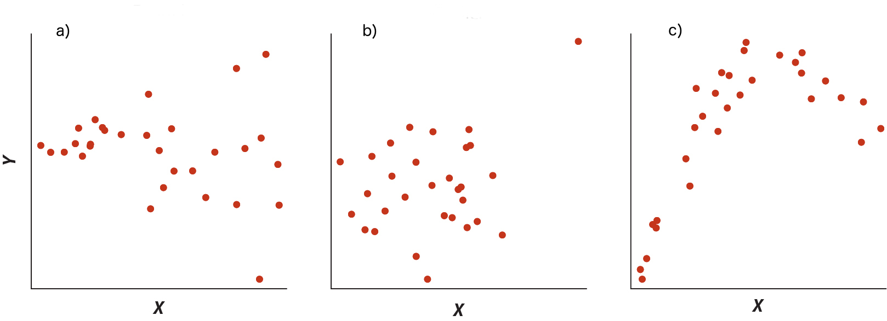
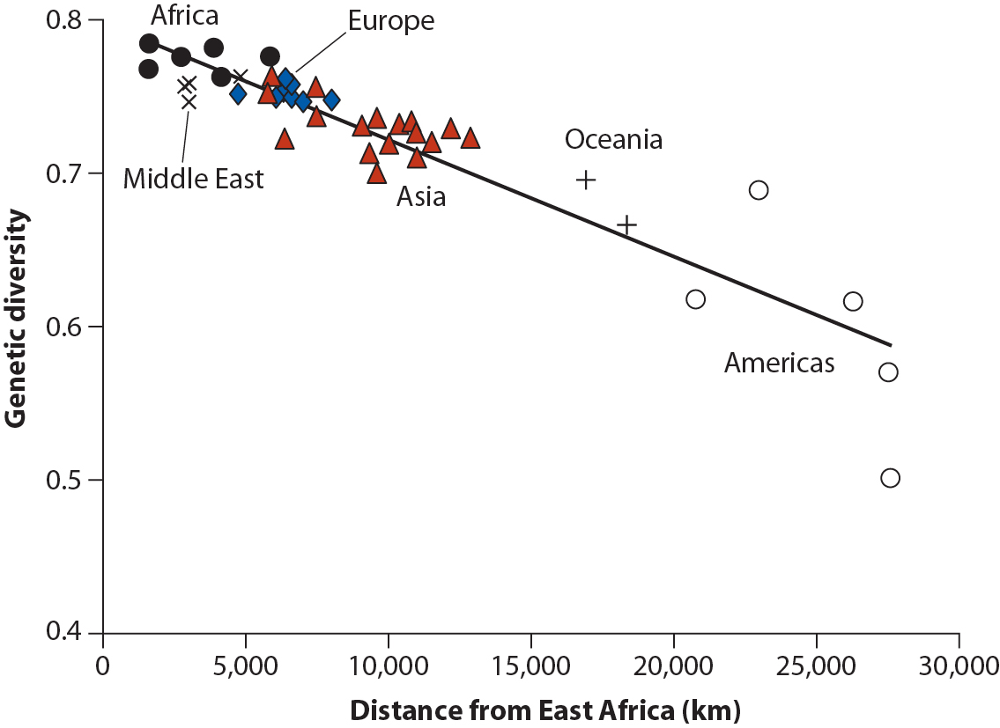



```{r}
#| label: setup
#| echo: false
library(checkdown)
```

## Objectifs de la capsule

À la fin de cette capsule, vous serez en mesure de:

1. Comprendre la **démarche** de la **régression linéaire**,
2. Utiliser la fonction générique **lm()** utilisée pour les régressions linéaires dans R,
3. **Valider les résultats** de votre analyse,
4. Calculer des **intervalles de confiances sur la moyenne** et les **prédictions de valeurs individuelles**.

Les méthodes utilisées dans ce script sont avancées, mais chacune peut être facilement comprise en étudiant l'aide relative aux fonctions utilisées (voir capsule #3).

## Capsule vidéo



[Télécharger le script R de la vidéo](www/capsule_11.R) (Faire boutton droit -> enregistrer sous...)

## Exercices

::: {.callout-note}
Veuillez noter qu’il est possible d’avoir plus d’une bonne réponse par question.
:::

::: {.callout-note appearance="simple" icon=false .question}

```{r}
#| label: question1
#| echo: false
#| results: "asis"
check_question(
  c("(3) La régression est une méthode statistique utilisée pour prédire la valeur moyenne d’une variable numérique Y (réponse) à une variable numérique X (explicative) à l’intérieur des limites observées pour celle-ci."),
  options = c(
    "(1) La régression est un test statistique permettant de vérifier l'existence et d’estimer la force d’une interaction entre deux variables numériques.",
    "(2) La régression est un test statistique permettant de vérifier l’existence d’une relation linéaire entre deux variables numériques.",
    "(3) La régression est une méthode statistique utilisée pour prédire la valeur moyenne d’une variable numérique Y (réponse) à une variable numérique X (explicative) à l’intérieur des limites observées pour celle-ci."
  ),
  type = "radio",
  button_label = "Vérifier",
  right = "✅ Correct ! (3) Si ses conditions d'application sont respectées, la régression linéaire simple permet en effet d'estimer la valeur moyenne que devrait prendre une variable réponse Y à une variable explicative X. La dernière partie de la définition est importante ici : l'estimation est valable seulement pour des valeurs de X comprise à l'intérieur des limites existantes, c'est à dire pour faire de l'interpolation, et non pas de l'extrapolation.",
  wrong = "❌ Incorrect. (1) Cette définition fait plutôt référence à la Corrélation, puisqu'elle ne mentionne pas de relation de causalité (variables réponse et explicative). (2) Il s'agit plutôt d'une condition d'application préalable pour la régression linéaire simple. Il est vrai que lors d'une régression, on teste la significativité de la pente de la droite (est-elle différente de 0 ?).",
  title = "Choisissez la bonne définition concernant la régression linéaire simple :"
)
```

:::

::: {.callout-note appearance="simple" icon=false .question}

```{r}
#| label: question2
#| echo: false
#| results: "asis"
check_question(
  c("On calcule l’équation de la droite de régression en maximisant la somme des carrés des écarts entre la prédiction faite par la droite et les valeurs observées en Y."),
  options = c("Une régression linéaire calcule l’équation d’une droite à travers un nuage de points dont les coordonnées sont les valeurs de la variable explicative en X et de la variable réponse en Y.", "On calcule l’équation de la droite de régression en maximisant la somme des carrés des écarts entre la prédiction faite par la droite et les valeurs observées en Y.", "Les résidus représentent la différence entre la prédiction faite par la droite et les valeurs observées en Y.", "L’intervalle de confiance calculé autour de l’estimé de la pente de la droite de régression est basé sur une distribution de Student (t)."),
  type = "radio",
  button_label = "Vérifier",
  right = "✅ Correct ! C'est le contraire, l'équation de la droite de régression minimise les écarts entre sa prédiction et les observations.",
  wrong = "❌ Incorrect. La méthode de la régression linéaire permet d'estimer les paramètres d'une droite décrivant mathématiquement la relation entre ces 2 variables quantitatives. L'équation de la droite de régression est celle qui minimise la somme des carrés des résidus. Chaque paramètre de l'équation de la droite est calculé avec un intervalle de confiance, et donc la valeur moyenne prédite aussi.",
  title = "Choisissez l’affirmation FAUSSE concernant la régression linéaire simple "
)
```

:::

::: {.callout-note appearance="simple" icon=false .question}

```{r}
#| label: question3
#| echo: false
#| results: "asis"
check_question(
  c("La valeur de R2 mesure la proportion de variance des observations qui est expliquée par la relation avec la variable explicative à travers la droite de régression."),
  options = c("La valeur de R2 est la pente de la droite de régression.", "La valeur de R2 mesure la proportion de variance des observations qui est expliquée par la relation avec la variable explicative à travers la droite de régression.", "La valeur de R2 permet de rejeter (ou non) l’hypothèse nulle qu’il n’y a pas de relation entre les variables réponse et explicative."),
  type = "radio",
  button_label = "Vérifier",
  right = "✅ Correct ! ",
  wrong = "❌ Incorrect. La valeur de R2 vous renseigne sur la capacité de la régression à expliquer la variabilité de observations. La troisième solution est la définition correspondant à la p-value du test de significativité de la pente de la droite, qui permet de rejeter (ou non) l'hypothèse nulle que la pente n'est pas différente de 0 (pas de relation entre les variables).",
  title = "Choisissez l’affirmation VRAIE concernant la valeur de R2 associée à la régression linéaire :"
)
```

:::

Associez à chaque graphique le problème principal que présentent les données et qui viole les **conditions d’application** de la régression linéaire simple :



::: {.callout-note appearance="simple" icon=false .question}

```{r}
#| label: question4
#| echo: false
#| results: "asis"
check_question(
  c("A"),
  options = c("A", "B", "C"),
  type = "radio",
  button_label = "Vérifier",
  right = "✅ Correct ! ",
  wrong = "❌ Réessayez! ",
  title = "Quel graphique démontre un problème d’hétéroscédasticité (la variance de la variable réponse augmente avec la valeur de la variable explicative)?"
)
```

:::

::: {.callout-note appearance="simple" icon=false .question}

```{r}
#| label: question5
#| echo: false
#| results: "asis"
check_question(
  c("B"),
  options = c("A", "B", "C"),
  type = "radio",
  button_label = "Vérifier",
  right = "✅ Correct ! ",
  wrong = "❌ Réessayez! ",
  title = "Quel graphique démontre l'absence de relation linéaire?"
)
```

:::

::: {.callout-note appearance="simple" icon=false .question}

```{r}
#| label: question6
#| echo: false
#| results: "asis"
check_question(
  c("C"),
  options = c("A", "B", "C"),
  type = "radio",
  button_label = "Vérifier",
  right = "✅ Correct ! ",
  wrong = "❌ Réessayez! ",
  title = "Quel graphique démontre un problème avec des valeurs extrêmes (*outliers*) qui vont influencer fortement la régression linéaire?"
)
```

:::

Voici un jeux de données. Il s’agit de variables mesurées sur 32 modèles d’automobiles et publiées dans le _Motor Trend US magazine_ de 1974. Nous voulons prédire la consommation moyenne d’essence des modèles automobiles 73-74 selon leur masse.

```{r}
#| echo: True
#| eval: True
plot(
  mtcars$mpg ~ mtcars$wt,
  xlab = "Masse (1000 lbs)",
  ylab = "Milage (miles / gallon)",
  main = "Consommation des automobiles"
)
```

::: {.callout-note appearance="simple" icon=false .question}

```{r}
#| label: question7
#| echo: false
#| results: "asis"
check_question(
  c("Il existe une relation linéaire entre les variables.", "Il est logique que la consommation d’essence dépende de la masse du véhicule à déplacer.", "Il s’agit de deux variables numériques quantitatives"),
  options = c("Il existe une relation linéaire entre les variables.", "Il est logique que la consommation d’essence dépende de la masse du véhicule à déplacer.", "Il s’agit de deux variables numériques quantitatives"),
  type = "checkbox",
  button_label = "Vérifier",
  right = "✅ Correct ! Vous devez constater toutes ces caractéristiques pour aller de l'avant avec votre analyse de régression linéaire simple.",
  wrong = "❌ Réessayez! ",
  title = "Après avoir observé le graphique, choisissez dans la liste ci-dessous TOUTES les caractéristiques de vos données qui vous permettent de penser que ce soit possible :"
)
```

:::

Faites un histogramme des variables explicative `mtcars$wt` (la masse) et réponse `mtcars$mpg` (le milage) et décidez si leur distribution de fréquence semble suivre une loi Normale.

```{webr}
#| autorun: false
```

::: {.callout-note appearance="simple" icon=false .question}

```{r}
#| label: question8
#| echo: false
#| results: "asis"
check_question(
  c("Oui"),
  options = c("Oui", "Non"),
  type = "radio",
  button_label = "Vérifier",
  right = "✅ Correct ! Cette distribution est unimodale, plutôt symétrique, sans valeurs extrêmes... on peut dire qu'elle respecte les conditions de normalité. Un test formel de normalité de Shapiro (shapiro.test()) ne permet pas de rejeter l'hypothèse nulle que la distribution est normalement distribuée.",
  wrong = "❌ Incorrect. ",
  title = "Est-ce que la masse suit une loi Normale?"
)
```

:::

::: {.callout-note appearance="simple" icon=false .question}

```{r}
#| label: question9
#| echo: false
#| results: "asis"
check_question(
  c("Oui"),
  options = c("Oui", "Non"),
  type = "radio",
  button_label = "Vérifier",
  right = "✅ Correct ! Cette distribution est unimodale, plutôt symétrique, sans valeurs extrêmes... on peut dire qu'elle respecte les conditions de normalité. Un test formel de normalité de Shapiro (shapiro.test()) ne permet pas de rejeter l'hypothèse nulle que la distribution est normalement distribuée.",
  wrong = "❌ Incorrect. ",
  title = "Est-ce que le milage suit une loi Normale?"
)
```

:::

Faites la régression linéaire entre ces deux variables en utilisant la fonction lm().

```{webr}
#| autorun: false
```

::: {.callout-warning collapse="true"}

### Solution

```{r}
#| echo: true
#| eval: true
lm(mtcars$mpg ~ mtcars$wt)
```

:::

::: {.callout-note appearance="simple" icon=false .question}

```{r}
#| label: question10
#| echo: false
#| results: "asis"
check_question(
  c("Environ -5"),
  options = c("Environ -12", "Environ -5", "Environ -8"),
  type = "radio",
  button_label = "Vérifier",
  right = "✅ Correct ! Il s'agit de l'estimé de la pente de la droite de régression.",
  wrong = "❌ Incorrect. ",
  title = "À partir des résultats de la régression, indiquez combien de “miles par gallon” sont perdus pour chaque 1000 lbs supplémentaire au véhicule."
)
```

:::

::: {.callout-note appearance="simple" icon=false .question}

```{r}
#| label: question11
#| echo: false
#| results: "asis"
check_question(
  c("Environ 37"),
  options = c("Environ 52", "Environ 37", "Environ 23"),
  type = "radio",
  button_label = "Vérifier",
  right = "✅ Correct ! Il s'agit de l'ordonnée à l'origine de la droite de régression.",
  wrong = "❌ Incorrect. ",
  title = "À partir des résultats de la régression, indiquez quelle serait la masse prévue par la régression linéaire pour qu’une automobile n’avance plus !"
)
```

:::

::: {.callout-note appearance="simple" icon=false .question}

```{r}
#| label: question12
#| echo: false
#| results: "asis"
check_question(
  c("Environ 75%"),
  options = c("Environ 58", "Environ 75%", "Environ 89"),
  type = "radio",
  button_label = "Vérifier",
  right = "✅ Correct ! Il s'agit du coefficient de régression R2.",
  wrong = "❌ Incorrect. ",
  title = "À partir des résultats de la régression, indiquez la proportion de variabilité dans les valeurs de milage expliquée par la masse des véhicules."
)
```

:::

::: {.callout-note appearance="simple" icon=false .question}

```{r}
#| label: question13
#| echo: false
#| results: "asis"
check_question(
  c("Environ 75%"),
  options = c("Environ 58", "Environ 75%", "Environ 89"),
  type = "radio",
  button_label = "Vérifier",
  right = "✅ Correct ! Il s'agit du coefficient de régression R2.",
  wrong = "❌ Incorrect. ",
  title = "À partir des résultats de la régression, donnez l’intervalle de confiance à 95% des valeurs de milage attendues pour un véhicule de 1973-1974 pesant 4750 lbs avec la fonction `predict()`."
)
```

:::

Finalement, on veut calculer l’intervalle de confiance à 95% des valeurs de milage attendues pour un véhicule de 1973-74 pesant 4750 lbs. En utilisant le modèle de régression suivant, complétez la function predict() avec la bonne option (remplacez les …) pour calculer les limites de cet intervalle :

```{webr}
#| autorun: false
mod <- lm(mpg ~ wt, data = mtcars)
predict(mod, newdata = data.frame(wt = 4750 / 1000), ...)
```

::: {.callout-tip collapse="true"}

### Indice

Utilisez le paramètre "interval" = ...
:::

::: {.callout-note appearance="simple" icon=false .question}

```{r}
#| label: question14
#| echo: false
#| results: "asis"
check_question(
  c("Environ 9-14"),
  options = c("Environ 10-12", "Environ 9-14", "Environ 15-18"),
  type = "radio",
  button_label = "Vérifier",
  right = "✅ Correct ! C'est l'intervalle de confiance à 95%.",
  wrong = "❌ Incorrect. ",
  title = "Quelle est l’intervalle de confiance à 95% des valeurs de milage attendues pour un véhicule de 1973-74 pesant 4750 lbs?"
)
```

:::

## Matériel accompagnateur

### Charger les données pour l'analyse

::: {.callout-note}
Tapez "Puromycin" dans l'aide de R pour en savoir plus (voir capsule #1).
:::

Il s'agit d'un jeu de données fourni avec R et qui comprend des valeurs d'activité enzymatique mesurées pour différentes concentrations de substrat dans deux groupes de cellules, le premier traité avec un antibiotique inhibiteur de synthèse protéique (la puromycine), et le second un groupe contrôle non traité.

On va d'abord charger le jeu de données, puis le rendre accessible en premier plan dans la mémoire de R :

```{r}
#| echo: true
#| eval: true
data("Puromycin")

Puromycin
```

### La **démarche** de la régression linéaire

Une analyse de régression linéaire simple est utile lorsqu'il existe un **lien de causalité entre deux variables quantitatives** (numériques et mesurables) et que l'on veut **prédire** la valeur de la variable **réponse** (dépendante) selon la valeur de la variable **explicative** (indépendante).



L'analyse de régression linéaire simple fait partie des méthodes statistiques (classiques) qui utilisent les propriétés mathématiques des distributions des variables, comme les tests paramétriques (voir capsule #8).

À ce titre, les données à analyser doivent respecter plusieurs conditions d'application :

1. La première est évidemment celle que l'on doit respecter (presque) toujours dans les analyses statistiques de base : les **échantillons doivent être aléatoires et indépendants**,

2. La deuxième est incluse dans le titre de la méthode : il doit exister une **relation linéaire entre les variables indépendante et dépendante**, ce qui peut se vérifier graphiquement. Cette condition est par ailleurs vérifiée si les conditions suivantes sont aussi vérifiées,

3. **L'homoscédasticité (homogénéité des variances) des résidus** de l'analyse. Les résidus sont simplement la différence entre la valeur observée et la valeur prédite par le modèle de régression linéaire. Ces résidus doivent être répartis de façon aléatoire et homogène de part et d'autre de la droite de régression et...

4. ...la distribution de ceux-ci doit respecter une distribution Normale de moyenne nulle, centrée sur la droite de régression. Il s'agit de la condition de **la normalité des résidus** de l'analyse.

La condition 2 peut bien sûr se vérifier _a priori_ graphiquement, alors que les conditions 3 et 4 se vérifient _a posteriori_ par des graphiques diagnostiques (voir capsule #9), mais aussi par des tests formels dont on verra un exemple ici.

::: {.callout-important}
L'analyse de régression linéaire utilise les propriétés mathématiques des données qui respectent ces conditions d'application pour déterminer les coefficients de la droite qui **minimise l'erreur** entre les valeurs observées de la variable réponse et les prédictions basées sur les valeurs de la variable explicative.  
:::

Nous pouvons illustrer ce principe avec le graphique ci-dessous :


Ici la **droite des moindres carrés** (en bleu) est celle qui **minimise les résidus** (en vert), c'est-à-dire la différence entre les observations (en rouge) et la valeur prédite par la droite de régression (en bleu). La méthode mathématique minimise la **somme des carrés des écarts (résidus)**, qu'on appelle aussi **l'erreur**.

### Analyse de régression linéaire simple

Le but de cet exemple est de calculer et tester la significativité de la relation entre un taux de réaction enzymatique et la concentration de substrat.

- Vérification de la relation linéaire

On va d'abord vérifier l'allure de la relation entre les variables réponse (l'activité enzymatique) et explicative la concentration de substrat) :

```{r}
#| echo: true
#| eval: true
# Indices pour les deux groupes de traitement
un <- Puromycin$state == "untreated"
tr <- Puromycin$state == "treated"

rate1 <- Puromycin$rate[un]
conc1 <- Puromycin$conc[un]

# Graphique en nuage de point pour le groupe témoin (pas de puromycine)
plot(
  rate1 ~ conc1,
  xlim = c(0, 1.5),
  ylim = c(0, 210),
  xlab = "Concentration de substrat (ppm)",
  ylab = "Taux de réaction enzymatique (#/min/min)",
  main = "Vélocité de réaction enzymatique"
)
```

Il apparaît évident que la relation entre lesvariables n'est pas linéaire, mais notre connaissance de la cinétique enzymatique nous permet de comprendre qu'on pourrait obtenir une relation linéaire en transformant les valeurs de concentration en log() !

```{r}
#| echo: true
#| eval: true
# Graphique en nuage de point pour le groupe témoin (pas de puromycine)
plot(
  rate1 ~ conc1,
  xlim = c(0.01, 1.5),
  ylim = c(0, 210),
  xlab = "Concentration de substrat (ppm; échelle log)",
  ylab = "Taux de réaction enzymatique (#/min/min)",
  main = "Vélocité de réaction enzymatique",
  log = "x"
)
```

Ici l'utilisation de l'argument (option) `log = 'x'` permet de représenter automatiquement nos données selon une **échelle logarithmique sur l'axe des abscisses**.

On constate qu'on semble bien avoir une relation linéaire entre les concentrations de substrat transformées par un logarithme et les taux de réaction enzymatique.

::: {.callout-important}
Pour la suite de nos analyses, nous allons créer une variable transformée pour les valeurs de concentration avec laquelle nous pourrons travailler.
:::

- Utilisation de la fonction lm()

L'analyse de régression linéaire fait partie de la grande famille des **"modèles linéaires"** en statistiques, d'où le nom de la fonction utilisée dans R : lm()

```{r}
#| echo: true
#| eval: true
# Procéder à l'analyse de régression linéaire simple (une seule variable explicative)
# ATTENTION à bien utiliser les valeurs transformées pour les concentrations de substrat
logc1 <- log10(conc1)

regl <- lm(rate1 ~ logc1)

# Visualisation des résultats de l'analyse
summary(regl)
```

Les résultats de cette analyse sont très riches en informations :

1. Tout d'abord, comme pour tous les tests semblables dans R, on vous rappelle le modèle linéaire testé, c'est à dire ici le taux de réaction enzymatique en fonction du log de la concentration de substrat :`lm(formula = rate1~ logc[un])`

2. Ensuite on vous présente un résumé de la distribution des valeurs des résidus : Residuals

3. Puis viennent les informations relatives aux coefficients de la régression linéaire : Coefficients

   - La première colonne Estimate donne les valeurs estimées de l'ordonnée à l'origine (Intercept) et la pente logc[un] (toujours le nom de la variable explicative) de la droite de régression
   - La deuxième colonne Std. Error donne l'erreur standard associée à l'estimation de ces valeurs,
   - La troisième colonne t value donne la valeur de _t_ utilisée pour tester les hypothèses nulles que ces valeurs ne sont pas significativement différentes de 0 à un seuil de confiance de 95%,
   - Finalement la dernière colonne Pr(>|t|) donne la valeur de la _p_-value permettant de tirer une conclusion de ces tests. On rappelle que si la _p_-value est < au seuil alpha = 0.05, alors on peut rejeter l'hypothèse nulle et conclure que les valeurs sont significativement différentes de 0. La ligne immédiatement sous ce tableau n'est qu'une sorte de "légende" pour aider à interpréter la force de la significativité.

4. Deux valeurs sont principalement d'intérêt dans la dernière section : Adjusted R-squared et F-statistic
   - Adjusted R-squared est appelé le **coefficient de régression R^2^** (_à ne pas confondres avec les coefficients de l'équation linéaire !_) et indique ici la proportion de variance expliquée par la variable... explicative. Ce n'est pas rare de voir une valeur de R^2^ > 0.9 en biochimie, lorsqu'on produit des courbes d'étalonnage par exemple; C'est beaucoup plus rare en écologie !
   - F-statistic est le résultat d'un test qui permet d'évaluer la significativité de la régression linéaire dans son ensemble, et pas seulement des paramètres de l'équation de la droite. Dans une régression linéaire simple, si la pente est significativement différente de 0, alors la _p_-value du test de F de la régression est < 0.05 et la régression est significative, comme dans ce cas-ci.

On peut visualiser très simplement notre droite de régression sur le graphique de nos données avec la fonction abline():

```{r}
#| echo: true
#| eval: False
# Ajout de la droite de régression suite à l'analyse
abline(regl, lwd = 2)
```

```{r}
#| echo: False
# Graphique en nuage de point pour le groupe témoin (pas de puromycine)
plot(
  rate1 ~ conc1,
  xlim = c(0.01, 1.5),
  ylim = c(0, 210),
  xlab = "Concentration de substrat (ppm; échelle log)",
  ylab = "Taux de réaction enzymatique (#/min/min)",
  main = "Vélocité de réaction enzymatique",
  log = "x"
)

# Ajout de la droite de régression suite à l'analyse
abline(regl, lwd = 2)
```

### Vérifier _a posteriori_ les conditions d'application de l'analyse de régression linéaire

On peut faire deux types de vérification (voir capsule #9) : visuelle et statistique

- Vérification **visuelle** des conditions d'application

```{r}
#| echo: true
#| eval: true
plot(regl, which = c(1, 2, 4))
```

Nous utilisons les 3 graphiques diagnostiques produits automatiquement par la fonction `plot()`, comme on l'a vu dans la capsule #9.

1. Le premier nous montre que les résidus de la régression présentés en fonction de la valeur "prédite" par le modèle linéaire de régression sont apparemment **répartis symétriquement et aléatoirement de part et d'autre de l'horizon 0**.

2. Le deuxième semble montrer par contre que certaines valeurs de résidus **ne suivent pas tout à fait une distribution Normale** (pas alignés sur la droite).

3. Le troisième montre finalement qu'aucune observation ne produit une valeur de distance de Cook > 0.5, ce qui confirme que notre analyse **n'est pas biaisée par une ou quelques valeurs extrêmes**. Une valeur > 0.5 est problématique.

Il apparaît donc de nos graphiques diagnostiques qu'en général nos données semblent respecter les conditions d'application, même si les conclusions ne sont pas toutes claires !

::: {.callout-warning}
Le nombre de valeurs analysées est faible (11), donc les conclusions des graphiques diagnostiques sont nécessairement moins claires que pour des analyses avec de grands nombres de points.
:::

- Vérification **statistique** des conditions d'application

La fonction gvlma() permet de vérifier en une fois si l'ensemble des conditions d'applications mathématiques sont remplies, grâce à plusieurs tests statistiques. Exemple :

```{r}
#| message: False
#| echo: true
#| eval: true
library(gvlma)
gvlma(regl)
```

::: {.callout-note}
N'oubliez pas d'installer la librarie gvlma à l'aide de la fonction install.packages().  
:::

Encore une fois, les résultats de cette analyse sont riches en informations :

1. D'abord on vous rappelle le modèle linéaire testé : Call

2. Ensuite les valeurs estimées des coefficients de la régression : Coefficients

3. Puis on clairement ce que cette fonction fait : ASSESSMENT OF THE LINEAR MODEL ASSUMPTIONS

4. Finalement, on détaille les résultats des différents tests sur les résidus. Chacun doit être interprété de la même façon : une statistique de test calculée Value, suivie de la _p_-value associée p-value et de la décision suggérée (Assumptions acceptable. ou Assumptions NOT satisfied!)
   - Global Stat est un test sur la **conformité globale** de notre analyse aux conditions d'application, au cas où un des tests spécifiques ci-dessous ne serait pas concluant,
   - Skewness vérifie la **symétrie** de la distribution des résidus par rapport à 0,
   - Kurtosis vérifie la **normalité** de la distribution des résidus ainsi que la présence de **valeurs extrêmes**,
   - Link Function vérifie la **linéarité** de la relation entre les variables réponse et explicative,
   - Heteroscedasticity vérifie **l'homogénéité de la variance** des résidus.

::: {.callout-warning}
Tous ces tests graphiques et statistiques restent des **aides à la décision**. Vous devez **exercer votre jugement en tout temps** pour décider si vous pouvez vous fier aux résultats de vos analyses.
:::

### Prédictions grâce à la régression linéaire

Comme on l'a indiqué dès le début de cette capsule, la régression linéaire permet de faire des prédictions, c'est-à-dire d'estimer la valeur moyenne que devrait avoir une variable réponse pour toute valeur de la variable explicative.

Toutefois cela est vrai dans les limites observées de la variable explicative, autrement dit la régression permet de faire avec confiance de **l'interpolation**, et elle ne devrait être utilisée qu'avec grande prudence pour faire de **l'extrapolation**.

- Prédiction de la valeur moyenne

Il est très facile de faire une telle prédiction. En fait, il s'agit simplement d'utiliser l'équation de la droite de régression `y = a + bx`, avec a l'ordonnée à l'origine et b la pente.

On peut toutefois utiliser la fonction predict() si on veut faire plusieurs prédictions facilement, par exemple.

```{r}
#| echo: true
#| eval: true
# Predire les taux de réaction enzymatique moyens pour des concentrations de
# substrat de 0.3, 0.35 et 0.4 ppm.
conx <- log10(c(0.3, 0.35, 0.4)) # Il ne faut pas oublier la transformation !
predict(regl, newdata = data.frame(logc1 = conx), interval = "confidence")
```

Les résultats de la fonction predict() donnent:

1. fit : la **valeur moyenne** prédite en x par la régression linéaire,
2. lwr : la **limite inférieure** de **l'intervalle de confiance à 95%** en x, selon la valeur de l'argument `interval = `
3. upr : la **limite supérieure** de l'intervalle de confiance à 95% en x, selon la valeur de cet argument.

L'ordre des lignes suit l'ordre des valeurs dans le vecteur x fourni à la fonction.

On remarque ici que la valeur de l'argument `interval = "confidence" `. Ceci permet de calculer **l'intervalle de confiance à 95% autour de la moyenne prédite**. Ça se traduit par ce genre de courbes :

```{r}
#| echo: True
#| eval: False
# Ajout des intervalles de confiance
xint <- seq(-2.1, 1.1, 0.1)
pred1 <- predict(regl, newdata = data.frame(logc1 = xint), interval = "confidence")
lines(10^xint, pred1[, 2], lty = 2, lwd = 2)
lines(10^xint, pred1[, 3], lty = 2, lwd = 2)
legend(
  "topleft",
  legend = "Intervalle de confiance à 95%\nautour de la moyenne prédite",
  lty = 2,
  lwd = 2,
  bty = "n"
)
```

```{r}
#| echo: False
#| eval: true
# Graphique en nuage de point pour le groupe témoin (pas de puromycine)
plot(
  rate1 ~ conc1,
  xlim = c(0.01, 1.5),
  ylim = c(0, 210),
  xlab = "Concentration de substrat (ppm; échelle log)",
  ylab = "Taux de réaction enzymatique (#/min/min)",
  main = "Vélocité de réaction enzymatique",
  log = "x"
)

# Ajout de la droite de régression suite à l'analyse
abline(regl, lwd = 2)

# Ajout des intervalles de confiance
xint <- seq(-2.1, 1.1, 0.1)
pred1 <- predict(regl, newdata = data.frame(logc1 = xint), interval = "confidence")

lines(10^xint, pred1[, 2], lty = 2, lwd = 2)
lines(10^xint, pred1[, 3], lty = 2, lwd = 2)

legend(
  "topleft",
  legend = "Intervalle de confiance à 95%\nautour de la moyenne prédite",
  lty = 2,
  lwd = 2,
  bty = "n"
)
```

- Prédiction de l'étendue des valeurs individuelles

Il est de plus possible d'estimer l'intervalle à l'intérieur duquel 95% des valeurs individuelles de la variable réponse observée **devraient se retrouver** d'après l'analyse de régression.

Ceci peut être utile pour **détecter des valeurs individuelles extrêmes**, ou **prédire une plage de valeurs possibles de la variable réponse pour une valeur encore jamais observée de la variable explicative**, par exemple.

Il faut alors spécifier une autre valeur à l'argument `interval` : `interval = "prediction" `. Ceci donne :

```{r}
#| echo: True
#| eval: False
# Ajout des intervalles de confiance
pred1 <- predict(regl, newdata = data.frame(logc1 = xint), interval = "prediction")
lines(10^xint, pred1[, 2], lty = 2, lwd = 2, col = "red")
lines(10^xint, pred1[, 3], lty = 2, lwd = 2, col = "red")
legend("topleft", legend = "Intervalle de confiance à 95% de la\ndistribution des valeurs individuelles\nd'activité enzymatique", lty = 2, lwd = 2, col = "red", bty = "n")
```

```{r}
#| echo: False
#| eval: True
# Graphique en nuage de point pour le groupe témoin (pas de puromycine)
plot(rate1 ~ conc1, xlim = c(0.01, 1.5), ylim = c(0, 210), xlab = "Concentration de substrat (ppm; échelle log)", ylab = "Taux de réaction enzymatique (#/min/min)", main = "Vélocité de réaction enzymatique", log = "x")

# Ajout de la droite de régression suite à l'analyse
abline(regl, lwd = 2)

# Ajout des intervalles de confiance
pred1 <- predict(regl, newdata = data.frame(logc1 = xint), interval = "prediction")
lines(10^xint, pred1[, 2], lty = 2, lwd = 2, col = "red")
lines(10^xint, pred1[, 3], lty = 2, lwd = 2, col = "red")
legend("topleft", legend = "Intervalle de confiance à 95% de la\ndistribution des valeurs individuelles\nd'activité enzymatique", lty = 2, lwd = 2, col = "red", bty = "n")
```

### Téléchargement

Le matériel pédagogique utilisé dans cette capsule est disponible pour le téléchargement sous deux formats différents:

1. Format PDF standard que vous pouvez consulter et commenter avec Adobe Reader par exemple.
2. Format HTML dynamique qui se comporte comme une page web et doit être lu avec votre navigateur préféré (Chrome, Firefox, Edge, Safari, etc.).

Pour télécharger le fichier localement sur votre ordinateur, tablette ou téléphone portable, il suffit de cliquer sur le lien désiré avec le bouton droit de votre souris et choisir "sauvegarder sous...".

Télécharger la documentation sous format PDF

- [Télécharger la documentation sous format PDF](www/capsule_11.pdf)
- [Télécharger la documentation sous format HTML](www/capsule_11.html)
